# 🎯 EGIE E-Commerce Admin System Flowchart

> **Note for Word Document**: Each flowchart is designed to fit on a single page. Connectors (marked with 🔗) reference other sections by number.

---

## 📋 **FLOWCHART 1: System Overview & Main Navigation**


---

## 🔐 **FLOWCHART 2: Authentication & Authorization**

```mermaid
graph TB
    Start([Sign In Page]) --> EnterCreds[Enter Email & Password]
    
    EnterCreds --> Submit[Click Sign In]
    Submit --> Validate{Credentials<br/>Valid?}
    
    Validate -->|Invalid| ShowError[❌ Show Error Message]
    ShowError --> Start
    
    Validate -->|Valid| CheckProfile{Check User<br/>Profile}
    
    CheckProfile --> GetRole[Retrieve User Role<br/>from Database]
    GetRole --> RoleCheck{Role Type?}
    
    RoleCheck -->|Customer| Unauthorized[⛔ Unauthorized Access]
    RoleCheck -->|Admin| AdminAccess[✅ Admin - Full Access<br/>🔗 See FC 15: Permissions]
    RoleCheck -->|Manager| ManagerAccess[✅ Manager - Limited Access<br/>🔗 See FC 15: Permissions]
    RoleCheck -->|Employee| EmployeeAccess[✅ Employee - Basic Access<br/>🔗 See FC 15: Permissions]
    
    Unauthorized --> SignOut[Sign Out User]
    SignOut --> Start
    
    AdminAccess --> Dashboard[🔗 FC 1: Dashboard]
    ManagerAccess --> Dashboard
    EmployeeAccess --> Dashboard
```

---

## 📊 **FLOWCHART 3: Dashboard Overview**

```mermaid
graph TB
    Dashboard[Dashboard Home] --> Sections{Dashboard Sections}
    
    Sections --> S1[Key Metrics<br/>🔗 See FC 3A]
    Sections --> S2[Order Overview<br/>🔗 See FC 3B]
    Sections --> S3[Inventory Status<br/>🔗 See FC 3C]
    Sections --> S4[Product Analytics<br/>🔗 See FC 3D]
    Sections --> S5[Recent Orders Table]
    Sections --> S6[Quick Actions]
    
    S5 --> ViewOrder[View Order Details<br/>🔗 See FC 7]
    S6 --> QA1[Create Product<br/>🔗 See FC 4]
    S6 --> QA2[View Orders<br/>🔗 See FC 7]
    S6 --> QA3[Manage Users<br/>🔗 See FC 6]
```

### **FLOWCHART 3A: Dashboard Key Metrics**

```mermaid
graph LR
    Metrics[Key Metrics Cards] --> M1[Total Sales<br/>💰 Amount + %]
    Metrics --> M2[Total Orders<br/>📋 Count + %]
    Metrics --> M3[Avg Order Value<br/>💵 Amount + %]
    Metrics --> M4[New Users<br/>👤 Count + %]
    Metrics --> M5[Total Users<br/>👥 Total Count]
    
    M1 --> Period1[Filter: Day/Week/Month]
    M2 --> Period2[Filter: Day/Week/Month]
    M3 --> Period3[Filter: Day/Week/Month]
    M4 --> Period4[Filter: Day/Week/Month]
    M5 --> Period5[Filter: Day/Week/Month]
```

### **FLOWCHART 3B: Dashboard Order Overview**

```mermaid
graph LR
    Orders[Order Overview] --> O1[Shipping Chart<br/>📊 Visual Stats]
    Orders --> O2[Active Orders<br/>🟢 In Progress]
    Orders --> O3[Cancelled Orders<br/>🔴 Cancelled]
    Orders --> O4[Active Discounts<br/>🎫 Active Promos]
    Orders --> O5[Orders by Status<br/>📈 Breakdown]
    
    O1 --> Status1[Pending/Processing/<br/>Shipped/Delivered]
    O5 --> Status2[Total/Completed/<br/>Ongoing/New]
```

### **FLOWCHART 3C: Dashboard Inventory**

```mermaid
graph LR
    Inventory[Inventory Status] --> I1[Total Products<br/>📦 Count]
    Inventory --> I2[Low Stock Items<br/>⚠️ Alert Count]
    Inventory --> I3[Out of Stock<br/>❌ Zero Stock]
    Inventory --> I4[Total Bundles<br/>📦 Bundle Count]
    
    I2 --> LowClick[Click to View<br/>🔗 FC 4: Products]
    I3 --> OutClick[Click to View<br/>🔗 FC 4: Products]
```

### **FLOWCHART 3D: Dashboard Product Analytics**

```mermaid
graph LR
    Analytics[Product Analytics] --> A1[Most Clicked<br/>👁️ Top 5 Views]
    Analytics --> A2[Top Selling<br/>💰 Top 5 Sales]
    Analytics --> A3[Payment Status<br/>💳 Success/Pending/Failed]
    Analytics --> A4[Conversion Rate<br/>📈 Percentage]
    
    A1 --> ViewProd1[Click to View Product<br/>🔗 FC 5: Product Details]
    A2 --> ViewProd2[Click to View Product<br/>🔗 FC 5: Product Details]
```

---

## 👥 **FLOWCHART 6: User Management**

```mermaid
graph TB
    Users[User Management Page] --> UserList[Users List Table]
    
    UserList --> Filters{Filter Options}
    Filters --> F1[🔽 By Role<br/>All/Admin/Manager/Employee/Customer]
    Filters --> F2[🔽 By Status<br/>Active/Banned/Inactive]
    Filters --> F3[🔍 Search by Name/Email]
    Filters --> F4[📅 By Registration Date]
    
    UserList --> Display[User Display Columns]
    Display --> D1[Profile Picture]
    Display --> D2[Full Name]
    Display --> D3[Email]
    Display --> D4[Role Badge]
    Display --> D5[Status]
    Display --> D6[Last Login]
    Display --> D7[Actions]
    
    UserList --> Actions{User Actions}
    Actions --> A1[👁️ View Details<br/>🔗 See FC 6A]
    Actions --> A2[✏️ Edit User<br/>🔗 See FC 6B]
    Actions --> A3[🚫 Ban/Unban]
    Actions --> A4[📤 Export Users]
    
    A3 --> BanConfirm{Confirm Ban?}
    BanConfirm -->|No| UserList
    BanConfirm -->|Yes| UpdateStatus[Update User Status]
    UpdateStatus --> LogBan[Log Action<br/>🔗 FC 13]
    LogBan --> NotifyUser[Send Notification]
    NotifyUser --> UserList
```

### **FLOWCHART 6A: View User Details**

```mermaid
graph TB
    ViewUser[View User Details Drawer] --> Sections{Information Sections}
    
    Sections --> S1[👤 Profile Information]
    Sections --> S2[📋 Order History]
    Sections --> S3[📊 User Statistics]
    Sections --> S4[🔐 Account Status]
    Sections --> S5[📝 Activity Log]
    
    S1 --> Profile[Profile Details]
    Profile --> P1[Full Name]
    Profile --> P2[Email Address]
    Profile --> P3[Phone Number]
    Profile --> P4[Complete Address]
    Profile --> P5[Barangay]
    Profile --> P6[Role Badge]
    Profile --> P7[Member Since]
    Profile --> P8[Last Login Time]
    
    S2 --> Orders[Order History]
    Orders --> O1[Total Orders]
    Orders --> O2[Order List]
    Orders --> O3[View Order Details<br/>🔗 FC 7]
    
    S3 --> Stats[User Stats]
    Stats --> ST1[Total Spent]
    Stats --> ST2[Average Order Value]
    Stats --> ST3[Total Reviews]
    Stats --> ST4[Account Age]
    
    S4 --> Account[Account Info]
    Account --> AC1[Email Verified?]
    Account --> AC2[Account Status]
    Account --> AC3[Role & Permissions]
    
    ViewUser --> Actions{Available Actions}
    Actions --> A1[✏️ Edit User Info<br/>🔗 FC 6B]
    Actions --> A2[🔄 Change Role<br/>🔗 FC 6C]
    Actions --> A3[🚫 Ban/Unban User]
    Actions --> A4[📧 Send Email]
    Actions --> A5[📥 Download User Data]
```

### **FLOWCHART 6B: Edit User Information**

```mermaid
graph TB
    EditUser[Edit User Form] --> Fields{Editable Fields}
    
    Fields --> F1[Full Name]
    Fields --> F2[Email Address]
    Fields --> F3[Phone Number]
    Fields --> F4[Address Details]
    Fields --> F5[Barangay]
    Fields --> F6[Profile Picture]
    Fields --> F7[Account Status]
    
    EditUser --> ModifyFields[Modify Fields]
    ModifyFields --> Validate{Validation Check}
    
    Validate -->|Invalid Email| EmailError[❌ Invalid Email Format]
    Validate -->|Invalid Phone| PhoneError[❌ Invalid Phone Format]
    Validate -->|Missing Required| RequiredError[❌ Required Fields Missing]
    Validate -->|Valid| ConfirmChanges{Confirm Changes?}
    
    EmailError --> EditUser
    PhoneError --> EditUser
    RequiredError --> EditUser
    
    ConfirmChanges -->|No| Cancel[Cancel Edit]
    ConfirmChanges -->|Yes| SaveChanges[Save to Database]
    
    SaveChanges --> LogEdit[Log Action<br/>🔗 FC 13]
    LogEdit --> SendNotif[Send Email Notification<br/>to User]
    SendNotif --> Success[✅ Changes Saved]
    Success --> BackToList[Return to User List]
```

### **FLOWCHART 6C: Change User Role**

```mermaid
graph TB
    ChangeRole[Change User Role] --> CurrentRole[Display Current Role]
    CurrentRole --> RoleOptions{Select New Role}
    
    RoleOptions --> R1[👑 Admin<br/>Full Access]
    RoleOptions --> R2[👔 Manager<br/>Limited Access]
    RoleOptions --> R3[👨‍💼 Employee<br/>Basic Access]
    RoleOptions --> R4[🛒 Customer<br/>No Admin Access]
    
    R1 --> PermCheck{Permission Check}
    R2 --> PermCheck
    R3 --> PermCheck
    R4 --> PermCheck
    
    PermCheck -->|Not Admin| NoPermission[❌ Only Admins Can<br/>Promote/Demote]
    PermCheck -->|Is Admin| ConfirmRole{Confirm Role Change?}
    
    NoPermission --> ChangeRole
    
    ConfirmRole -->|No| Cancel[Cancel Action]
    ConfirmRole -->|Yes| UpdateRole[Update User Role]
    
    UpdateRole --> UpdatePermissions[Update Access Permissions<br/>🔗 See FC 15]
    UpdatePermissions --> LogRole[Log Action<br/>🔗 FC 13]
    LogRole --> SendEmail[Send Role Change Email]
    SendEmail --> Success[✅ Role Updated]
    Success --> ViewUser[Return to User Details<br/>🔗 FC 6A]
```

---

## 📋 **FLOWCHART 7: Order Management**

```mermaid
graph TB
    Orders[Order Management Page] --> OrderList[Orders List Table]
    
    OrderList --> Filters{Filter Options}
    Filters --> F1[🔽 By Status]
    Filters --> F2[🔽 By Payment Method]
    Filters --> F3[🔽 By Payment Status]
    Filters --> F4[📅 Date Range]
    Filters --> F5[🔍 Search Order Number]
    
    OrderList --> Display[Order Display Columns]
    Display --> D1[Order Number]
    Display --> D2[Customer Name]
    Display --> D3[Total Amount]
    Display --> D4[Status Badge]
    Display --> D5[Payment Status]
    Display --> D6[Order Date]
    Display --> D7[Actions]
    
    OrderList --> Actions{Order Actions}
    Actions --> A1[👁️ View Details<br/>🔗 See FC 7A]
    Actions --> A2[🔄 Update Status<br/>🔗 See FC 7B]
    Actions --> A3[❌ Cancel Order<br/>🔗 See FC 7C]
    Actions --> A4[📤 Export Orders]
    Actions --> A5[🖨️ Print Invoice]
```

### **FLOWCHART 7A: View Order Details**

```mermaid
graph TB
    ViewOrder[Order Details Drawer] --> Sections{Information Sections}
    
    Sections --> S1[📋 Order Information]
    Sections --> S2[👤 Customer Information]
    Sections --> S3[📦 Order Items]
    Sections --> S4[💳 Payment Details]
    Sections --> S5[🚚 Shipping Details]
    Sections --> S6[🎫 Voucher Info]
    
    S1 --> OrderInfo[Order Info]
    OrderInfo --> OI1[Order Number]
    OrderInfo --> OI2[Order Date & Time]
    OrderInfo --> OI3[Order Status]
    OrderInfo --> OI4[Total Amount]
    OrderInfo --> OI5[Subtotal]
    OrderInfo --> OI6[Shipping Fee]
    OrderInfo --> OI7[Discount Applied]
    
    S2 --> Customer[Customer Info]
    Customer --> C1[Full Name]
    Customer --> C2[Email & Phone]
    Customer --> C3[Delivery Address]
    Customer --> C4[Barangay]
    Customer --> C5[Special Instructions]
    
    S3 --> Items[Order Items List]
    Items --> I1[Product Image]
    Items --> I2[Product Name]
    Items --> I3[Quantity]
    Items --> I4[Unit Price]
    Items --> I5[Subtotal]
    Items --> I6[View Product<br/>🔗 FC 5B]
    
    S4 --> Payment[Payment Info]
    Payment --> PM1[Payment Method]
    Payment --> PM2[Transaction ID]
    Payment --> PM3[Payment Status]
    Payment --> PM4[Payment Date]
    Payment --> PM5[View Payment<br/>🔗 FC 8]
    
    S5 --> Shipping[Shipping Info]
    Shipping --> SH1[Tracking Number]
    Shipping --> SH2[Courier]
    Shipping --> SH3[Shipping Status]
    Shipping --> SH4[View Shipping<br/>🔗 FC 9]
    
    ViewOrder --> QuickActions{Quick Actions}
    QuickActions --> QA1[🔄 Update Status<br/>🔗 FC 7B]
    QuickActions --> QA2[🖨️ Print Invoice]
    QuickActions --> QA3[📧 Email Customer]
    QuickActions --> QA4[❌ Cancel Order<br/>🔗 FC 7C]
```

### **FLOWCHART 7B: Update Order Status**

```mermaid
graph TB
    UpdateStatus[Update Order Status] --> Current[Display Current Status]
    Current --> StatusOptions{Select New Status}
    
    StatusOptions --> S1[⏳ Pending]
    StatusOptions --> S2[🔄 Processing]
    StatusOptions --> S3[📦 Ready for Pickup]
    StatusOptions --> S4[🚚 On Delivery]
    StatusOptions --> S5[📍 Delivered]
    StatusOptions --> S6[✅ Completed]
    StatusOptions --> S7[❌ Cancelled]
    
    S1 --> ValidateFlow{Valid Status<br/>Transition?}
    S2 --> ValidateFlow
    S3 --> ValidateFlow
    S4 --> ValidateFlow
    S5 --> ValidateFlow
    S6 --> ValidateFlow
    S7 --> ValidateFlow
    
    ValidateFlow -->|Invalid| FlowError[❌ Invalid Status Flow<br/>Cannot Skip Steps]
    ValidateFlow -->|Valid| ConfirmStatus{Confirm Status Change?}
    
    FlowError --> UpdateStatus
    
    ConfirmStatus -->|No| Cancel[Cancel Action]
    ConfirmStatus -->|Yes| UpdateDB[Update Order Status]
    
    UpdateDB --> CheckStock{Status = Completed<br/>or Cancelled?}
    CheckStock -->|Cancelled| RestoreStock[Restore Product Stock]
    CheckStock -->|Completed| DeductStock[Deduct Stock if not done]
    CheckStock -->|Other| Skip[Skip Stock Update]
    
    RestoreStock --> LogAction
    DeductStock --> LogAction
    Skip --> LogAction
    
    LogAction[Log Status Change<br/>🔗 FC 13] --> NotifyCustomer[Send Email/SMS<br/>Notification]
    NotifyCustomer --> UpdateShipping{Update Shipping?}
    UpdateShipping -->|Yes| ShippingUpdate[🔗 FC 9: Update Shipping]
    UpdateShipping -->|No| Success[✅ Status Updated]
    ShippingUpdate --> Success
```

### **FLOWCHART 7C: Cancel Order**


---

## 💳 **FLOWCHART 8: Payment Management**

```mermaid
graph TB
    Payment[Payment Management Page] --> PaymentList[Payments List Table]
    
    PaymentList --> Filters{Filter Options}
    Filters --> F1[🔽 Payment Method<br/>PayMongo/COD/GCash]
    Filters --> F2[🔽 Payment Status<br/>Pending/Completed/Failed]
    Filters --> F3[💰 Amount Range]
    Filters --> F4[📅 Date Range]
    Filters --> F5[🔍 Search Transaction ID]
    
    PaymentList --> Display[Payment Display]
    Display --> D1[Transaction ID]
    Display --> D2[Order Number]
    Display --> D3[Customer Name]
    Display --> D4[Payment Method]
    Display --> D5[Amount]
    Display --> D6[Status Badge]
    Display --> D7[Date & Time]
    Display --> D8[Actions]
    
    PaymentList --> Actions{Payment Actions}
    Actions --> A1[👁️ View Details<br/>🔗 See FC 8A]
    Actions --> A2[✅ Verify Payment<br/>🔗 See FC 8B]
    Actions --> A3[💵 Process Refund<br/>🔗 See FC 8C]
    Actions --> A4[📤 Export Payments]
```

### **FLOWCHART 8A: View Payment Details**

```mermaid
graph TB
    ViewPayment[Payment Details View] --> Info{Payment Information}
    
    Info --> I1[💳 Payment Details]
    Info --> I2[📋 Order Reference]
    Info --> I3[👤 Customer Info]
    Info --> I4[📊 Transaction History]
    
    I1 --> PayDetails[Payment Details]
    PayDetails --> PD1[Transaction ID]
    PayDetails --> PD2[Payment Method]
    PayDetails --> PD3[Payment Status]
    PayDetails --> PD4[Amount Paid]
    PayDetails --> PD5[Payment Date & Time]
    PayDetails --> PD6[Payment Gateway Response]
    PayDetails --> PD7[Reference Number]
    
    I2 --> OrderRef[Order Reference]
    OrderRef --> OR1[Order Number]
    OrderRef --> OR2[Order Total]
    OrderRef --> OR3[Order Status]
    OrderRef --> OR4[View Order<br/>🔗 FC 7A]
    
    I3 --> CustInfo[Customer Info]
    CustInfo --> CI1[Customer Name]
    CustInfo --> CI2[Email]
    CustInfo --> CI3[Phone]
    CustInfo --> CI4[View Customer<br/>🔗 FC 6A]
    
    I4 --> TransHistory[Transaction Events]
    TransHistory --> TH1[Payment Initiated]
    TransHistory --> TH2[Payment Processing]
    TransHistory --> TH3[Payment Completed/Failed]
    TransHistory --> TH4[Refund Initiated if any]
    
    ViewPayment --> Actions{Available Actions}
    Actions --> A1[✅ Mark as Verified<br/>🔗 FC 8B]
    Actions --> A2[💵 Process Refund<br/>🔗 FC 8C]
    Actions --> A3[📧 Send Receipt]
    Actions --> A4[🖨️ Print Receipt]
```

### **FLOWCHART 8B: Verify Payment**

```mermaid
graph TB
    Verify[Verify Payment] --> CheckStatus{Current Status?}
    
    CheckStatus -->|Completed| AlreadyVerified[✅ Already Verified]
    CheckStatus -->|Failed| CannotVerify[❌ Failed Payment<br/>Cannot Verify]
    CheckStatus -->|Pending| VerifyProcess[Start Verification]
    
    AlreadyVerified --> End1[Return to Payments]
    CannotVerify --> End2[Return to Payments]
    
    VerifyProcess --> CheckMethod{Payment Method?}
    CheckMethod -->|PayMongo| CheckGateway[Check PayMongo Gateway]
    CheckMethod -->|GCash| ManualVerify[Manual Verification]
    CheckMethod -->|COD| CODVerify[Verify Cash Received]
    
    CheckGateway --> GatewayResponse{Gateway Response?}
    GatewayResponse -->|Success| UpdateSuccess
    GatewayResponse -->|Failed| UpdateFailed
    GatewayResponse -->|Pending| KeepPending[Keep as Pending]
    
    ManualVerify --> UploadProof[Request Payment Proof]
    UploadProof --> ReviewProof{Review Proof?}
    ReviewProof -->|Valid| UpdateSuccess
    ReviewProof -->|Invalid| UpdateFailed
    
    CODVerify --> ConfirmReceived{Cash Confirmed?}
    ConfirmReceived -->|Yes| UpdateSuccess
    ConfirmReceived -->|No| KeepPending
    
    UpdateSuccess[Update Status: Completed]
    UpdateSuccess --> UpdateOrder[Update Order Status<br/>🔗 FC 7B]
    UpdateOrder --> LogVerify[Log Action<br/>🔗 FC 13]
    LogVerify --> SendReceipt[Send Payment Receipt]
    SendReceipt --> Success[✅ Payment Verified]
    
    UpdateFailed[Update Status: Failed]
    UpdateFailed --> NotifyFailed[Notify Customer]
    NotifyFailed --> End3[Return to Payments]
    
    KeepPending --> End4[Return to Payments]
```

### **FLOWCHART 8C: Process Refund**

```mermaid
graph TB
    Refund[Process Refund Request] --> CheckEligibility{Refund Eligible?}
    
    CheckEligibility -->|Not Paid| NoRefund[❌ No Payment Made<br/>Cannot Refund]
    CheckEligibility -->|Already Refunded| AlreadyDone[✅ Already Refunded]
    CheckEligibility -->|COD| CODRefund[❌ COD Orders<br/>Manual Refund Process]
    CheckEligibility -->|Eligible| RefundForm[Refund Details Form]
    
    NoRefund --> End1[Return to Payment]
    AlreadyDone --> End1
    CODRefund --> End1
    
    RefundForm --> RF1[Refund Amount]
    RF1 --> RF2[Refund Reason]
    RF2 --> RF3[Additional Notes]
    RF3 --> ConfirmRefund{Confirm Refund?}
    
    ConfirmRefund -->|No| Cancel[Cancel Refund]
    ConfirmRefund -->|Yes| InitiateRefund[Initiate PayMongo Refund]
    
    InitiateRefund --> PayMongoAPI[Call PayMongo API]
    PayMongoAPI --> APIResponse{API Response?}
    
    APIResponse -->|Success| RefundSuccess[Refund Initiated]
    APIResponse -->|Failed| RefundFailed[❌ Refund Failed]
    
    RefundSuccess --> UpdatePayment[Update Payment Status:<br/>Refunded]
    UpdatePayment --> UpdateOrderCancel[Update Order Status:<br/>Cancelled<br/>🔗 FC 7B]
    UpdateOrderCancel --> RestoreStock[Restore Product Stock]
    RestoreStock --> LogRefund[Log Action<br/>🔗 FC 13]
    LogRefund --> NotifyCustomer[Send Refund Email]
    NotifyCustomer --> Success[✅ Refund Processed]
    
    RefundFailed --> LogError[Log Error]
    LogError --> ShowError[Show Error Message]
    ShowError --> RefundForm
```

---

## 🚚 **FLOWCHART 9: Shipping Management**

```mermaid
graph TB
    Shipping[Shipping Management Page] --> ShipList[Shipping Orders List]
    
    ShipList --> Filters{Filter Options}
    Filters --> F1[🔽 Shipping Status]
    Filters --> F2[📍 By Location/Barangay]
    Filters --> F3[🚚 By Courier]
    Filters --> F4[📅 Date Range]
    Filters --> F5[🔍 Search Tracking Number]
    
    ShipList --> Display[Shipping Display]
    Display --> D1[Order Number]
    Display --> D2[Customer Name]
    Display --> D3[Destination]
    Display --> D4[Tracking Number]
    Display --> D5[Courier]
    Display --> D6[Status Badge]
    Display --> D7[Ship Date]
    Display --> D8[Actions]
    
    ShipList --> Actions{Shipping Actions}
    Actions --> A1[👁️ View Details<br/>🔗 See FC 9A]
    Actions --> A2[🔄 Update Tracking<br/>🔗 See FC 9B]
    Actions --> A3[🚚 Assign Courier<br/>🔗 See FC 9C]
    Actions --> A4[🖨️ Print Label]
    Actions --> A5[📤 Export Data]
```

### **FLOWCHART 9A: View Shipment Details**

```mermaid
graph TB
    ViewShip[Shipment Details View] --> Sections{Information Sections}
    
    Sections --> S1[📦 Shipment Information]
    Sections --> S2[📋 Order Reference]
    Sections --> S3[📍 Delivery Address]
    Sections --> S4[🚚 Courier Information]
    Sections --> S5[📊 Tracking History]
    
    S1 --> ShipInfo[Shipment Info]
    ShipInfo --> SI1[Tracking Number]
    ShipInfo --> SI2[Shipping Status]
    ShipInfo --> SI3[Ship Date]
    ShipInfo --> SI4[Estimated Delivery]
    ShipInfo --> SI5[Actual Delivery Date]
    ShipInfo --> SI6[Package Weight/Size]
    
    S2 --> OrderRef[Order Reference]
    OrderRef --> OR1[Order Number]
    OrderRef --> OR2[Items Count]
    OrderRef --> OR3[Order Value]
    OrderRef --> OR4[View Order<br/>🔗 FC 7A]
    
    S3 --> Address[Delivery Address]
    Address --> AD1[Recipient Name]
    Address --> AD2[Phone Number]
    Address --> AD3[Complete Address]
    Address --> AD4[Barangay]
    Address --> AD5[Delivery Instructions]
    
    S4 --> Courier[Courier Info]
    Courier --> CO1[Courier Service Name]
    Courier --> CO2[Courier Contact]
    Courier --> CO3[Delivery Type]
    Courier --> CO4[Shipping Fee]
    
    S5 --> Tracking[Tracking History Timeline]
    Tracking --> T1[Order Placed]
    Tracking --> T2[Package Prepared]
    Tracking --> T3[Out for Delivery]
    Tracking --> T4[Delivered]
    
    ViewShip --> Actions{Available Actions}
    Actions --> A1[🔄 Update Tracking<br/>🔗 FC 9B]
    Actions --> A2[🖨️ Print Shipping Label]
    Actions --> A3[📧 Email Tracking Info]
    Actions --> A4[📱 SMS Customer]
```

### **FLOWCHART 9B: Update Tracking Information**

```mermaid
graph TB
    UpdateTracking[Update Tracking] --> TrackingForm[Tracking Update Form]
    
    TrackingForm --> SelectStatus{Select Shipping Status}
    SelectStatus --> ST1[📦 Package Prepared]
    SelectStatus --> ST2[🚚 Picked up by Courier]
    SelectStatus --> ST3[📍 In Transit]
    SelectStatus --> ST4[🏢 Out for Delivery]
    SelectStatus --> ST5[✅ Delivered]
    SelectStatus --> ST6[❌ Failed Delivery]
    SelectStatus --> ST7[🔙 Returned to Sender]
    
    ST1 --> AddDetails[Add Update Details]
    ST2 --> AddDetails
    ST3 --> AddDetails
    ST4 --> AddDetails
    ST5 --> AddDetails
    ST6 --> AddDetails
    ST7 --> AddDetails
    
    AddDetails --> Form[Fill Details]
    Form --> F1[Current Location]
    F1 --> F2[Update Date & Time]
    F2 --> F3[Status Notes/Remarks]
    F3 --> F4[Upload Photo Proof]
    
    F4 --> SpecialCases{Special Cases?}
    SpecialCases -->|Delivered| RequireProof[Require Delivery Proof<br/>Photo/Signature]
    SpecialCases -->|Failed| RequireReason[Require Failure Reason]
    SpecialCases -->|Other| SaveUpdate
    
    RequireProof --> ValidateProof{Proof Provided?}
    ValidateProof -->|No| ErrorProof[❌ Proof Required]
    ValidateProof -->|Yes| SaveUpdate
    ErrorProof --> Form
    
    RequireReason --> ReasonProvided{Reason Provided?}
    ReasonProvided -->|No| ErrorReason[❌ Reason Required]
    ReasonProvided -->|Yes| SaveUpdate
    ErrorReason --> Form
    
    SaveUpdate[Save Tracking Update]
    SaveUpdate --> UpdateDatabase[Update Database]
    UpdateDatabase --> CheckDelivered{Status = Delivered?}
    
    CheckDelivered -->|Yes| UpdateOrder[Update Order Status:<br/>Delivered<br/>🔗 FC 7B]
    CheckDelivered -->|No| SkipOrder[Skip Order Update]
    
    UpdateOrder --> LogUpdate
    SkipOrder --> LogUpdate
    
    LogUpdate[Log Action<br/>🔗 FC 13] --> NotifyCustomer[Send Notification<br/>Email/SMS]
    NotifyCustomer --> Success[✅ Tracking Updated]
```

### **FLOWCHART 9C: Assign Courier**

```mermaid
graph TB
    AssignCourier[Assign Courier] --> CheckExisting{Already<br/>Assigned?}
    
    CheckExisting -->|Yes| ReassignConfirm{Reassign<br/>Courier?}
    CheckExisting -->|No| SelectCourier
    
    ReassignConfirm -->|No| Cancel[Cancel Action]
    ReassignConfirm -->|Yes| SelectCourier
    
    SelectCourier[Select Courier Service]
    SelectCourier --> CourierOptions{Courier Options}
    
    CourierOptions --> C1[J&T Express]
    CourierOptions --> C2[LBC]
    CourierOptions --> C3[JRS Express]
    CourierOptions --> C4[Grab Express]
    CourierOptions --> C5[Lalamove]
    CourierOptions --> C6[Custom/Other]
    
    C1 --> CourierDetails
    C2 --> CourierDetails
    C3 --> CourierDetails
    C4 --> CourierDetails
    C5 --> CourierDetails
    C6 --> CourierDetails
    
    CourierDetails[Enter Courier Details]
    CourierDetails --> CD1[Courier Contact Number]
    CD1 --> CD2[Delivery Type<br/>Standard/Express]
    CD2 --> CD3[Estimated Delivery Days]
    CD3 --> CD4[Shipping Fee]
    
    CD4 --> GenerateTracking{Generate Tracking<br/>Number?}
    GenerateTracking -->|Auto| AutoGenerate[Auto-generate Tracking]
    GenerateTracking -->|Manual| ManualTracking[Enter Tracking Number]
    
    AutoGenerate --> ReviewAssignment
    ManualTracking --> ReviewAssignment
    
    ReviewAssignment[Review Assignment]
    ReviewAssignment --> ConfirmAssign{Confirm<br/>Assignment?}
    
    ConfirmAssign -->|No| Cancel
    ConfirmAssign -->|Yes| SaveAssignment[Save Courier Assignment]
    
    SaveAssignment --> UpdateShipping[Update Shipping Record]
    UpdateShipping --> LogAssign[Log Action<br/>🔗 FC 13]
    LogAssign --> NotifyCourier[Notify Courier if applicable]
    NotifyCourier --> NotifyCustomer[Send Tracking to Customer]
    NotifyCustomer --> Success[✅ Courier Assigned]
```

---

## 📝 **FLOWCHART 10: Contact & Feedback Management**

```mermaid
graph TB
    ContactFeed[Contact & Feedback] --> TabSelect{Select Tab}
    
    TabSelect --> Contact[📧 Contact Submissions<br/>🔗 See FC 10A]
    TabSelect --> Feedback[⭐ Product Feedback<br/>🔗 See FC 10B]
```

### **FLOWCHART 10A: Contact Submissions**

```mermaid
graph TB
    Contact[Contact Submissions Page] --> MessageList[Messages List]
    
    MessageList --> Filters{Filter Options}
    Filters --> F1[📭 Read/Unread]
    Filters --> F2[📅 By Date]
    Filters --> F3[🔍 Search by Name/Email]
    Filters --> F4[📋 By Subject]
    
    MessageList --> Display[Message Display]
    Display --> D1[🔴 Unread Indicator]
    Display --> D2[Sender Name]
    Display --> D3[Email Address]
    Display --> D4[Subject]
    Display --> D5[Message Preview]
    Display --> D6[Date Received]
    Display --> D7[Actions]
    
    MessageList --> Actions{Message Actions}
    Actions --> A1[👁️ View Message<br/>🔗 See FC 10A-1]
    Actions --> A2[✅ Mark as Read]
    Actions --> A3[📧 Reply via Email]
    Actions --> A4[🗑️ Delete Message]
    
    A2 --> MarkRead[Update Read Status]
    MarkRead --> RefreshList[Refresh List]
    
    A4 --> ConfirmDelete{Confirm Delete?}
    ConfirmDelete -->|No| MessageList
    ConfirmDelete -->|Yes| DeleteMsg[Delete from Database]
    DeleteMsg --> LogDelete[Log Action<br/>🔗 FC 13]
    LogDelete --> RefreshList
```

#### **FLOWCHART 10A-1: View Contact Message**

```mermaid
graph TB
    ViewMsg[View Message Details] --> MessageContent{Message Content}
    
    MessageContent --> MC1[👤 Sender Information]
    MessageContent --> MC2[📧 Message Details]
    MessageContent --> MC3[📅 Metadata]
    
    MC1 --> Sender[Sender Info]
    Sender --> S1[Full Name]
    Sender --> S2[Email Address]
    Sender --> S3[Phone Number if provided]
    Sender --> S4[User Account if registered<br/>🔗 FC 6A]
    
    MC2 --> Message[Message Content]
    Message --> M1[Subject]
    Message --> M2[Full Message Body]
    Message --> M3[Attachments if any]
    
    MC3 --> Meta[Metadata]
    Meta --> MT1[Submission Date & Time]
    Meta --> MT2[IP Address]
    Meta --> MT3[Read Status]
    Meta --> MT4[Reply Status]
    
    ViewMsg --> Actions{Available Actions}
    Actions --> A1[📧 Reply to Sender]
    Actions --> A2[✅ Mark as Read]
    Actions --> A3[🗑️ Delete Message]
    Actions --> A4[📤 Forward to Email]
    
    A1 --> ReplyForm[Email Reply Form]
    ReplyForm --> RF1[Pre-filled To Email]
    RF1 --> RF2[Subject: Re Original]
    RF2 --> RF3[Compose Reply]
    RF3 --> SendReply{Send Email?}
    SendReply -->|No| Cancel[Cancel]
    SendReply -->|Yes| SendEmail[Send via Email Service]
    SendEmail --> UpdateStatus[Mark as Replied]
    UpdateStatus --> Success[✅ Reply Sent]
```

### **FLOWCHART 10B: Product Feedback Management**

```mermaid
graph TB
    Feedback[Product Feedback Page] --> ReviewList[Reviews List]
    
    ReviewList --> Filters{Filter Options}
    Filters --> F1[⭐ By Rating 1-5]
    Filters --> F2[📦 By Product]
    Filters --> F3[✅ By Status<br/>Pending/Approved/Rejected]
    Filters --> F4[📅 By Date]
    Filters --> F5[🔍 Search by Content]
    
    ReviewList --> Display[Review Display]
    Display --> D1[Product Image]
    Display --> D2[Product Name]
    Display --> D3[Customer Name]
    Display --> D4[Rating Stars]
    Display --> D5[Review Text Preview]
    Display --> D6[Review Date]
    Display --> D7[Status Badge]
    Display --> D8[Actions]
    
    ReviewList --> Actions{Review Actions}
    Actions --> A1[👁️ View Full Review<br/>🔗 See FC 10B-1]
    Actions --> A2[✅ Approve Review]
    Actions --> A3[❌ Reject Review]
    Actions --> A4[🗑️ Delete Review]
    Actions --> A5[📤 Export Reviews]
    
    A2 --> ApproveConfirm{Confirm Approve?}
    ApproveConfirm -->|Yes| UpdateApprove[Update Status: Approved]
    ApproveConfirm -->|No| ReviewList
    UpdateApprove --> LogApprove[Log Action<br/>🔗 FC 13]
    LogApprove --> NotifyUser[Notify Customer]
    NotifyUser --> ReviewList
    
    A3 --> RejectForm[Rejection Reason Form]
    RejectForm --> EnterReason[Enter Rejection Reason]
    EnterReason --> ConfirmReject{Confirm Reject?}
    ConfirmReject -->|Yes| UpdateReject[Update Status: Rejected]
    ConfirmReject -->|No| ReviewList
    UpdateReject --> LogReject[Log Action<br/>🔗 FC 13]
    LogReject --> NotifyReject[Notify Customer with Reason]
    NotifyReject --> ReviewList
```

#### **FLOWCHART 10B-1: View Full Review Details**

```mermaid
graph TB
    ViewReview[View Review Details] --> Content{Review Content}
    
    Content --> C1[📦 Product Information]
    Content --> C2[👤 Customer Information]
    Content --> C3[⭐ Review Content]
    Content --> C4[✅ Verification Status]
    
    C1 --> Product[Product Info]
    Product --> P1[Product Name]
    Product --> P2[Product Image]
    Product --> P3[View Product<br/>🔗 FC 5B]
    
    C2 --> Customer[Customer Info]
    Customer --> CU1[Customer Name]
    Customer --> CU2[Customer Email]
    Customer --> CU3[Verified Purchase?]
    Customer --> CU4[View Customer<br/>🔗 FC 6A]
    
    C3 --> Review[Review Details]
    Review --> R1[Rating Stars 1-5]
    Review --> R2[Review Title]
    Review --> R3[Full Review Text]
    Review --> R4[Review Images if any]
    Review --> R5[Review Date]
    Review --> R6[Helpful Count]
    
    C4 --> Verification[Verification]
    Verification --> V1[Purchase Verified?]
    Verification --> V2[Review Status]
    Verification --> V3[Moderation Notes]
    
    ViewReview --> Actions{Available Actions}
    Actions --> A1[✅ Approve]
    Actions --> A2[❌ Reject]
    Actions --> A3[✏️ Edit Review]
    Actions --> A4[🗑️ Delete]
    Actions --> A5[📧 Contact Reviewer]
```

---

## 🎫 **FLOWCHART 11: Promotions Management**

```mermaid
graph TB
    Promotions[Promotions Management] --> PromoTabs{Select Tab}
    
    PromoTabs --> T1[🎫 Vouchers<br/>🔗 See FC 11A]
    PromoTabs --> T2[💰 Discounts<br/>🔗 See FC 11B]
    PromoTabs --> T3[📢 Popup Ads<br/>🔗 See FC 11C]
```

### **FLOWCHART 11A: Voucher Management**

```mermaid
graph TB
    Vouchers[Vouchers Tab] --> VoucherList[Vouchers List]
    
    VoucherList --> Display[Voucher Display]
    Display --> D1[Voucher Code]
    Display --> D2[Discount Type/Value]
    Display --> D3[Min Purchase]
    Display --> D4[Usage Count/Limit]
    Display --> D5[Valid Period]
    Display --> D6[Status Active/Inactive]
    Display --> D7[Actions]
    
    VoucherList --> Actions{Voucher Actions}
    Actions --> A1[➕ Create Voucher<br/>🔗 See FC 11A-1]
    Actions --> A2[✏️ Edit Voucher]
    Actions --> A3[🗑️ Delete Voucher]
    Actions --> A4[📊 View Usage Stats]
    Actions --> A5[🔄 Toggle Active/Inactive]
    
    A3 --> ConfirmDelete{Confirm Delete?}
    ConfirmDelete -->|No| VoucherList
    ConfirmDelete -->|Yes| DeleteVoucher[Delete from Database]
    DeleteVoucher --> LogDelete[Log Action<br/>🔗 FC 13]
    LogDelete --> VoucherList
    
    A4 --> ViewStats[View Usage Statistics]
    ViewStats --> Stats[Display Stats]
    Stats --> ST1[Total Uses]
    Stats --> ST2[Total Discount Given]
    Stats --> ST3[Usage by Date]
    Stats --> ST4[Top Users]
```

#### **FLOWCHART 11A-1: Create Voucher**

```mermaid
graph TB
    CreateVoucher[Create New Voucher] --> VoucherForm[Voucher Form]
    
    VoucherForm --> Step1[1️⃣ Voucher Code]
    Step1 --> S1A{Code Type?}
    S1A -->|Auto-generate| AutoCode[Generate Random Code]
    S1A -->|Custom| ManualCode[Enter Custom Code]
    
    AutoCode --> Step2
    ManualCode --> CheckUnique{Code Available?}
    CheckUnique -->|No| CodeTaken[❌ Code Already Exists]
    CheckUnique -->|Yes| Step2
    CodeTaken --> ManualCode
    
    Step2[2️⃣ Discount Settings]
    Step2 --> S2A{Discount Type?}
    S2A -->|Percentage| PercentDiscount[Enter Discount %]
    S2A -->|Fixed Amount| FixedDiscount[Enter Fixed Amount]
    
    PercentDiscount --> S2B[Set Max Discount Cap]
    FixedDiscount --> Step3
    S2B --> Step3
    
    Step3[3️⃣ Usage Restrictions]
    Step3 --> S3A[Min Purchase Amount]
    S3A --> S3B[Max Uses Total]
    S3B --> S3C[Max Uses Per User]
    S3C --> S3D[Applicable Products/Categories]
    
    S3D --> Step4[4️⃣ Validity Period]
    Step4 --> S4A[Valid From Date]
    S4A --> S4B[Valid To Date]
    S4B --> ValidateDates{Dates Valid?}
    ValidateDates -->|End before Start| DateError[❌ Invalid Date Range]
    ValidateDates -->|Valid| Step5
    DateError --> Step4
    
    Step5[5️⃣ Additional Settings]
    Step5 --> S5A[Voucher Description]
    S5A --> S5B[Terms & Conditions]
    S5B --> S5C[Active Status]
    
    S5C --> ReviewVoucher[Review All Settings]
    ReviewVoucher --> ValidateVoucher{Validation}
    ValidateVoucher -->|Failed| ShowErrors[Show Errors]
    ValidateVoucher -->|Success| SaveVoucher[Save Voucher]
    ShowErrors --> VoucherForm
    SaveVoucher --> LogCreate[Log Action<br/>🔗 FC 13]
    LogCreate --> Success[✅ Voucher Created]
```

### **FLOWCHART 11B: Product Discounts**

```mermaid
graph TB
    Discounts[Discounts Tab] --> DiscountView[Product Discounts View]
    
    DiscountView --> Display[Products with Discounts]
    Display --> D1[Product Name]
    Display --> D2[Original Price]
    Display --> D3[Discount %]
    Display --> D4[Discounted Price]
    Display --> D5[Valid Period]
    Display --> D6[Status]
    Display --> D7[Actions]
    
    DiscountView --> Actions{Discount Actions}
    Actions --> A1[➕ Apply Discount<br/>🔗 See FC 11B-1]
    Actions --> A2[✏️ Edit Discount]
    Actions --> A3[❌ Remove Discount]
    Actions --> A4[📦 Bulk Apply Discount]
    Actions --> A5[📤 Export Discounts]
    
    A3 --> ConfirmRemove{Confirm Remove?}
    ConfirmRemove -->|No| DiscountView
    ConfirmRemove -->|Yes| RemoveDiscount[Remove Discount]
    RemoveDiscount --> RestorePrice[Restore Original Price]
    RestorePrice --> LogRemove[Log Action<br/>🔗 FC 13]
    LogRemove --> DiscountView
    
    A4 --> BulkSelect[Select Multiple Products]
    BulkSelect --> BulkSettings[Apply Bulk Discount<br/>🔗 FC 11B-1]
```

#### **FLOWCHART 11B-1: Apply Product Discount**

```mermaid
graph TB
    ApplyDiscount[Apply Discount] --> SelectProducts[Select Product]
    
    SelectProducts --> SearchProd[Search/Browse Products]
    SearchProd --> SelectSingle{Selection Type?}
    SelectSingle -->|Single| SingleProd[Select One Product]
    SelectSingle -->|Multiple| MultiProd[Select Multiple Products]
    SelectSingle -->|Category| CategorySelect[Select Entire Category]
    SelectSingle -->|Brand| BrandSelect[Select Entire Brand]
    
    SingleProd --> DiscountForm
    MultiProd --> DiscountForm
    CategorySelect --> DiscountForm
    BrandSelect --> DiscountForm
    
    DiscountForm[Discount Settings Form]
    DiscountForm --> DF1[Discount Percentage %]
    DF1 --> ValidatePercent{Valid %?}
    ValidatePercent -->|0-100| DF2
    ValidatePercent -->|Invalid| PercentError[❌ Invalid Percentage]
    PercentError --> DF1
    
    DF2[Calculate New Prices]
    DF2 --> DF3[Set Validity Period]
    DF3 --> DF4[Valid From Date]
    DF4 --> DF5[Valid To Date]
    DF5 --> DF6[Auto-Restore Price?]
    
    DF6 --> ReviewDiscount[Review Discount Summary]
    ReviewDiscount --> ShowSummary[Show Products & New Prices]
    ShowSummary --> ConfirmApply{Confirm Apply?}
    
    ConfirmApply -->|No| Cancel[Cancel]
    ConfirmApply -->|Yes| ApplyToProducts[Apply Discount to Products]
    
    ApplyToProducts --> UpdatePrices[Update Product Prices]
    UpdatePrices --> SetSchedule{Auto-restore set?}
    SetSchedule -->|Yes| ScheduleRestore[Schedule Auto-restore]
    SetSchedule -->|No| SkipSchedule
    ScheduleRestore --> LogApply
    SkipSchedule --> LogApply
    
    LogApply[Log Action<br/>🔗 FC 13]
    LogApply --> Success[✅ Discount Applied]
```

### **FLOWCHART 11C: Popup Ads Management**

```mermaid
graph TB
    Popups[Popup Ads Tab] --> PopupList[Popup Ads List]
    
    PopupList --> Display[Popup Display]
    Display --> D1[Popup Preview Image]
    Display --> D2[Popup Title]
    Display --> D3[Display Settings]
    Display --> D4[Active Status]
    Display --> D5[Views Count]
    Display --> D6[Click Rate]
    Display --> D7[Actions]
    
    PopupList --> Actions{Popup Actions}
    Actions --> A1[➕ Create Popup<br/>🔗 See FC 11C-1]
    Actions --> A2[✏️ Edit Popup]
    Actions --> A3[👁️ Preview Popup]
    Actions --> A4[🗑️ Delete Popup]
    Actions --> A5[🔄 Toggle Active/Inactive]
    Actions --> A6[📊 View Analytics]
    
    A3 --> ShowPreview[Show Popup Preview Modal]
    ShowPreview --> PreviewClose[Close Preview]
    
    A4 --> ConfirmDelete{Confirm Delete?}
    ConfirmDelete -->|No| PopupList
    ConfirmDelete -->|Yes| DeletePopup[Delete from Database]
    DeletePopup --> DeleteImage[Delete Images from Storage]
    DeleteImage --> LogDelete[Log Action<br/>🔗 FC 13]
    LogDelete --> PopupList
```

#### **FLOWCHART 11C-1: Create Popup Ad**

```mermaid
graph TB
    CreatePopup[Create Popup Ad] --> PopupForm[Popup Ad Form]
    
    PopupForm --> Step1[1️⃣ Basic Information]
    Step1 --> S1A[Popup Title]
    S1A --> S1B[Popup Description]
    S1B --> S1C[Call-to-Action Text]
    S1C --> S1D[Button Link URL]
    
    S1D --> Step2[2️⃣ Upload Images]
    Step2 --> S2A[Upload Popup Image Desktop]
    S2A --> S2B[Upload Popup Image Mobile]
    S2B --> ValidateImages{Images Valid?}
    ValidateImages -->|Invalid Size/Format| ImageError[❌ Invalid Image]
    ValidateImages -->|Valid| Step3
    ImageError --> Step2
    
    Step3[3️⃣ Display Settings]
    Step3 --> S3A{Display Trigger?}
    S3A -->|On Page Load| SetDelay[Set Delay seconds]
    S3A -->|On Exit Intent| ExitSettings[Exit Intent Settings]
    S3A -->|On Scroll| ScrollSettings[Scroll % Settings]
    S3A -->|Timed| TimedSettings[Time Interval Settings]
    
    SetDelay --> S3B
    ExitSettings --> S3B
    ScrollSettings --> S3B
    TimedSettings --> S3B
    
    S3B[Display Frequency]
    S3B --> S3C{Frequency Option?}
    S3C -->|Every Visit| EveryVisit
    S3C -->|Once per Session| PerSession
    S3C -->|Once per Day| PerDay
    S3C -->|Once per Week| PerWeek
    
    EveryVisit --> Step4
    PerSession --> Step4
    PerDay --> Step4
    PerWeek --> Step4
    
    Step4[4️⃣ Targeting & Schedule]
    Step4 --> S4A[Target Pages All/Specific]
    S4A --> S4B[Start Date & Time]
    S4B --> S4C[End Date & Time Optional]
    S4C --> S4D[Active Status]
    
    S4D --> ReviewPopup[Review Popup Settings]
    ReviewPopup --> PreviewTest[Preview Test]
    PreviewTest --> ValidatePopup{Validation}
    ValidatePopup -->|Failed| ShowErrors[Show Errors]
    ValidatePopup -->|Success| SavePopup[Save Popup]
    ShowErrors --> PopupForm
    
    SavePopup --> UploadImages[Upload Images to Storage]
    UploadImages --> LogCreate[Log Action<br/>🔗 FC 13]
    LogCreate --> Success[✅ Popup Created]
```

---

## 📦 **FLOWCHART 4: Product Management - Main**

```mermaid
graph TB
    Products[Product Management Page] --> Tabs{Select Tab}
    
    Tabs --> T1[📦 Inventory<br/>🔗 See FC 4A]
    Tabs --> T2[📊 Stocks<br/>🔗 See FC 4B]
    Tabs --> T3[📦 Bundles<br/>🔗 See FC 4C]
    Tabs --> T4[🏷️ Categories<br/>🔗 See FC 4D]
    
    Products --> GlobalActions[Global Actions]
    GlobalActions --> GA1[🔍 Search Products]
    GlobalActions --> GA2[🔽 Filter by Category]
    GlobalActions --> GA3[🔽 Filter by Brand]
    GlobalActions --> GA4[🔽 Filter by Status]
    GlobalActions --> GA5[📥 Export Data]
```

### **FLOWCHART 4A: Product Inventory Management**

```mermaid
graph TB
    Inventory[Inventory Tab] --> ProductList[Product List Table]
    
    ProductList --> Actions{Row Actions}
    Actions --> A1[👁️ View Details<br/>🔗 See FC 5]
    Actions --> A2[✏️ Edit Product<br/>🔗 See FC 5B]
    Actions --> A3[🗑️ Delete Product]
    Actions --> A4[📋 Duplicate Product]
    
    Inventory --> CreateNew[➕ Create New Product<br/>🔗 See FC 5A]
    
    ProductList --> Display[Display Info]
    Display --> D1[Product Image]
    Display --> D2[Name & SKU]
    Display --> D3[Category & Brand]
    Display --> D4[Price & Discount]
    Display --> D5[Stock Quantity]
    Display --> D6[Status Badge]
    
    A3 --> Confirm{Confirm Delete?}
    Confirm -->|No| ProductList
    Confirm -->|Yes| DeleteProd[Delete from Database]
    DeleteProd --> LogDelete[Log Action<br/>🔗 FC 13]
    LogDelete --> Refresh[Refresh List]
```

### **FLOWCHART 4B: Stock Management**

```mermaid
graph TB
    Stocks[Stocks Tab] --> StockView[Stock Overview]
    
    StockView --> Filters{Filter View}
    Filters --> F1[🔴 Out of Stock]
    Filters --> F2[⚠️ Low Stock]
    Filters --> F3[🟢 In Stock]
    Filters --> F4[📊 All Products]
    
    StockView --> Actions{Stock Actions}
    Actions --> A1[Update Stock<br/>Quantity]
    Actions --> A2[Set Reorder Level]
    Actions --> A3[Bulk Update]
    Actions --> A4[Export Stock Report]
    
    A1 --> UpdateForm[Stock Update Form]
    UpdateForm --> Enter[Enter New Quantity]
    Enter --> Reason[Add Reason/Note]
    Reason --> SaveStock[Save Update]
    SaveStock --> LogStock[Log Action<br/>🔗 FC 13]
    LogStock --> UpdateDB[Update Database]
    UpdateDB --> CheckLevel{Stock Level?}
    CheckLevel -->|Low| SendAlert[Send Low Stock Alert]
    CheckLevel -->|Normal| StockView
    SendAlert --> StockView
```

### **FLOWCHART 4C: Bundle Management**

```mermaid
graph TB
    Bundles[Bundles Tab] --> BundleList[Bundle Products List]
    
    BundleList --> Actions{Actions}
    Actions --> A1[👁️ View Bundle]
    Actions --> A2[✏️ Edit Bundle]
    Actions --> A3[🗑️ Delete Bundle]
    Actions --> A4[📋 Duplicate Bundle]
    
    Bundles --> CreateBundle[➕ Create New Bundle]
    
    CreateBundle --> Step1[Step 1: Bundle Info]
    Step1 --> S1A[Enter Bundle Name]
    S1A --> S1B[Enter Description]
    S1B --> S1C[Upload Bundle Image]
    
    S1C --> Step2[Step 2: Select Products]
    Step2 --> S2A[Search Products]
    S2A --> S2B[Add to Bundle]
    S2B --> S2C[Set Quantities]
    
    S2C --> Step3[Step 3: Pricing]
    Step3 --> S3A[Calculate Total Price]
    S3A --> S3B[Set Bundle Discount %]
    S3B --> S3C[Final Bundle Price]
    
    S3C --> Step4[Step 4: Review & Save]
    Step4 --> Validate{Valid Bundle?}
    Validate -->|No| ShowErrors[Show Errors]
    ShowErrors --> Step1
    Validate -->|Yes| SaveBundle[Save Bundle]
    SaveBundle --> LogBundle[Log Action<br/>🔗 FC 13]
    LogBundle --> BundleList
```

### **FLOWCHART 4D: Category Management**

```mermaid
graph TB
    Categories[Categories Tab] --> CatList[Categories List]
    
    CatList --> Display[Category Display]
    Display --> D1[Category Name]
    Display --> D2[Category Image]
    Display --> D3[Product Count]
    Display --> D4[Status]
    
    CatList --> Actions{Actions}
    Actions --> A1[➕ Add Category]
    Actions --> A2[✏️ Edit Category]
    Actions --> A3[🗑️ Delete Category]
    Actions --> A4[🔼 Reorder Categories]
    
    A1 --> AddForm[Add Category Form]
    AddForm --> F1[Enter Category Name]
    F1 --> F2[Upload Category Image]
    F2 --> F3[Set Display Order]
    F3 --> F4[Set Status Active/Inactive]
    F4 --> SaveCat[Save Category]
    SaveCat --> CatList
    
    A3 --> CheckProducts{Has Products?}
    CheckProducts -->|Yes| CannotDelete[❌ Cannot Delete<br/>Has Products]
    CheckProducts -->|No| ConfirmDelete{Confirm?}
    ConfirmDelete -->|Yes| DeleteCat[Delete Category]
    DeleteCat --> CatList
    ConfirmDelete -->|No| CatList
```

---

## 📝 **FLOWCHART 5: Product Details & Creation**

### **FLOWCHART 5A: Create New Product**

```mermaid
graph TB
    Start[Create New Product] --> Form[Product Creation Form]
    
    Form --> Section1[1️⃣ Basic Information]
    Section1 --> S1A[Product Name*]
    S1A --> S1B[Brand*]
    S1B --> S1C[Category*]
    S1C --> S1D[Description*]
    S1D --> S1E[Product Type]
    
    S1E --> Section2[2️⃣ Pricing]
    Section2 --> S2A[Base Price*]
    S2A --> S2B[Discount %]
    S2B --> S2C[Final Price Calculated]
    
    S2C --> Section3[3️⃣ Inventory]
    Section3 --> S3A[Initial Stock*]
    S3A --> S3B[SKU Auto-generated]
    S3B --> S3C[Low Stock Alert Level]
    
    S3C --> Section4[4️⃣ Images]
    Section4 --> S4A[Upload Main Image*]
    S4A --> S4B[Upload Gallery Images]
    S4B --> S4C[Set Image Order]
    
    S4C --> Section5[5️⃣ Specifications]
    Section5 --> S5A[Add Spec Fields]
    S5A --> S5B[Key-Value Pairs]
    
    S5B --> Section6[6️⃣ Compatibility]
    Section6 --> S6A[Add Compatibility Tags]
    S6A --> S6B[Select Compatible Products]
    
    S6B --> Review[Review All Fields]
    Review --> Validate{Validation}
    Validate -->|Failed| Errors[Show Validation Errors]
    Errors --> Form
    Validate -->|Success| Save[Save Product to Database]
    Save --> Upload[Upload Images to Storage]
    Upload --> LogCreate[Log Action<br/>🔗 FC 13]
    LogCreate --> Success[✅ Product Created]
    Success --> ViewNew[View New Product<br/>🔗 FC 5B]
```

### **FLOWCHART 5B: View/Edit Product Details**

```mermaid
graph TB
    View[Product Details View] --> Info{Information Sections}
    
    Info --> I1[📋 Basic Info]
    Info --> I2[💰 Pricing]
    Info --> I3[📦 Stock Info]
    Info --> I4[🖼️ Images]
    Info --> I5[📝 Specifications]
    Info --> I6[🔗 Compatibility]
    Info --> I7[📊 Statistics]
    
    I7 --> Stats[View Statistics]
    Stats --> ST1[Total Views]
    Stats --> ST2[Total Sales]
    Stats --> ST3[Revenue Generated]
    Stats --> ST4[Average Rating]
    
    View --> Actions{Actions Available}
    Actions --> A1[✏️ Edit Product]
    Actions --> A2[📋 Duplicate]
    Actions --> A3[🗑️ Delete]
    Actions --> A4[🔄 Update Stock]
    Actions --> A5[📤 Export Details]
    
    A1 --> EditMode[Enter Edit Mode]
    EditMode --> ModifyFields[Modify Fields]
    ModifyFields --> SaveChanges[Save Changes]
    SaveChanges --> ValidateEdit{Valid?}
    ValidateEdit -->|No| EditErrors[Show Errors]
    EditErrors --> ModifyFields
    ValidateEdit -->|Yes| UpdateDB[Update Database]
    UpdateDB --> LogEdit[Log Action<br/>🔗 FC 13]
    LogEdit --> RefreshView[Refresh View]
```

---

## ⚖️ **FLOWCHART 12: Compliance Management**

```mermaid
graph TB
    Compliance[Compliance Management] --> CompTabs{Select Tab}
    
    CompTabs --> T1[📜 Policy Management<br/>🔗 See FC 12A]
    CompTabs --> T2[🚨 Breach Incidents<br/>🔗 See FC 12B]
    CompTabs --> T3[📋 Data Requests<br/>🔗 See FC 12C]
```

### **FLOWCHART 12A: Policy Management**

```mermaid
graph TB
    Policies[Policy Management] --> PolicyList[Policy Versions List]
    
    PolicyList --> Display[Policy Display]
    Display --> D1[Policy Type]
    Display --> D2[Version Number]
    Display --> D3[Effective Date]
    Display --> D4[Status Draft/Published]
    Display --> D5[Last Updated]
    Display --> D6[Actions]
    
    PolicyList --> Actions{Policy Actions}
    Actions --> A1[➕ Create New Version<br/>🔗 See FC 12A-1]
    Actions --> A2[👁️ View Policy]
    Actions --> A3[✏️ Edit Draft]
    Actions --> A4[📊 Compare Versions]
    Actions --> A5[📢 Publish Policy]
    Actions --> A6[🗑️ Delete Draft]
    
    A2 --> ViewPolicy[View Policy Content]
    ViewPolicy --> VC1[Policy Title]
    ViewPolicy --> VC2[Full Policy Text]
    ViewPolicy --> VC3[Version History]
    ViewPolicy --> VC4[Change Log]
    
    A4 --> CompareView[Compare Versions View]
    CompareView --> CV1[Select Version 1]
    CV1 --> CV2[Select Version 2]
    CV2 --> CV3[Show Diff Comparison]
    CV3 --> CV4[Highlight Changes]
    
    A5 --> PublishConfirm{Confirm Publish?}
    PublishConfirm -->|No| PolicyList
    PublishConfirm -->|Yes| PublishPolicy[Publish Policy Version]
    PublishPolicy --> NotifyUsers[Notify All Users<br/>Policy Update]
    NotifyUsers --> LogPublish[Log Action<br/>🔗 FC 13]
    LogPublish --> PolicyList
```

#### **FLOWCHART 12A-1: Create Policy Version**

```mermaid
graph TB
    CreatePolicy[Create New Policy Version] --> PolicyForm[Policy Editor]
    
    PolicyForm --> Step1[1️⃣ Policy Information]
    Step1 --> S1A{Policy Type?}
    S1A -->|Privacy Policy| TypePrivacy
    S1A -->|Terms of Service| TypeTerms
    S1A -->|Return Policy| TypeReturn
    S1A -->|Data Protection| TypeData
    S1A -->|Custom| TypeCustom
    
    TypePrivacy --> S1B
    TypeTerms --> S1B
    TypeReturn --> S1B
    TypeData --> S1B
    TypeCustom --> S1B
    
    S1B[Enter Policy Title]
    S1B --> S1C[Version Number<br/>Auto-increment]
    
    S1C --> Step2[2️⃣ Policy Content]
    Step2 --> S2A[Rich Text Editor]
    S2A --> S2B[Add Policy Sections]
    S2B --> S2C[Format Content]
    S2C --> S2D[Add Links/References]
    
    S2D --> Step3[3️⃣ Change Documentation]
    Step3 --> S3A[Summary of Changes]
    S3A --> S3B[Detailed Change Log]
    S3B --> S3C[Reason for Update]
    
    S3C --> Step4[4️⃣ Effective Date]
    Step4 --> S4A[Set Effective Date]
    S4A --> ValidateDate{Date Valid?}
    ValidateDate -->|Past Date| DateError[❌ Cannot be Past Date]
    ValidateDate -->|Valid| S4B
    DateError --> S4A
    
    S4B[User Notification Settings]
    S4B --> S4C[Notify All Users?]
    S4C --> S4D[Email Notification?]
    S4D --> S4E[In-App Notification?]
    
    S4E --> ReviewPolicy[Review Policy]
    ReviewPolicy --> SaveOption{Save Option?}
    SaveOption -->|Save as Draft| SaveDraft[Save Draft]
    SaveOption -->|Publish Now| PublishNow[Publish Immediately]
    SaveOption -->|Schedule| SchedulePub[Schedule Publication]
    
    SaveDraft --> LogSave[Log Action<br/>🔗 FC 13]
    PublishNow --> NotifyUsers[Send Notifications]
    SchedulePub --> SetSchedule[Set Publish Date/Time]
    
    NotifyUsers --> LogPublish[Log Action<br/>🔗 FC 13]
    SetSchedule --> LogSchedule[Log Action<br/>🔗 FC 13]
    
    LogSave --> Success[✅ Policy Saved]
    LogPublish --> Success
    LogSchedule --> Success
```

### **FLOWCHART 12B: Breach Incident Management**

```mermaid
graph TB
    Breaches[Breach Incidents] --> BreachList[Incidents List]
    
    BreachList --> Display[Incident Display]
    Display --> D1[Incident ID]
    Display --> D2[Incident Type]
    Display --> D3[Severity Badge]
    Display --> D4[Affected Users Count]
    Display --> D5[Status]
    Display --> D6[Discovery Date]
    Display --> D7[Actions]
    
    BreachList --> Filters{Filter Options}
    Filters --> F1[🔽 By Severity<br/>Low/Medium/High/Critical]
    Filters --> F2[🔽 By Status<br/>Reported/Investigating/Resolved]
    Filters --> F3[🔽 By Type]
    Filters --> F4[📅 By Date]
    
    BreachList --> Actions{Incident Actions}
    Actions --> A1[🚨 Report Incident<br/>🔗 See FC 12B-1]
    Actions --> A2[👁️ View Details<br/>🔗 See FC 12B-2]
    Actions --> A3[🔄 Update Status]
    Actions --> A4[📤 Export Report]
    
    A3 --> StatusUpdate{Select Status}
    StatusUpdate --> ST1[Reported]
    StatusUpdate --> ST2[Under Investigation]
    StatusUpdate --> ST3[Contained]
    StatusUpdate --> ST4[Resolved]
    StatusUpdate --> ST5[Closed]
    
    ST1 --> UpdateIncident
    ST2 --> UpdateIncident
    ST3 --> UpdateIncident
    ST4 --> UpdateIncident
    ST5 --> UpdateIncident
    
    UpdateIncident[Update Incident Status]
    UpdateIncident --> LogUpdate[Log Action<br/>🔗 FC 13]
    LogUpdate --> BreachList
```

#### **FLOWCHART 12B-1: Report Breach Incident**

```mermaid
graph TB
    ReportBreach[Report New Breach] --> BreachForm[Incident Report Form]
    
    BreachForm --> Step1[1️⃣ Incident Classification]
    Step1 --> S1A{Incident Type?}
    S1A -->|Data Breach| TypeData
    S1A -->|Unauthorized Access| TypeAccess
    S1A -->|Data Loss| TypeLoss
    S1A -->|System Compromise| TypeSystem
    S1A -->|Privacy Violation| TypePrivacy
    S1A -->|Other| TypeOther
    
    TypeData --> S1B
    TypeAccess --> S1B
    TypeLoss --> S1B
    TypeSystem --> S1B
    TypePrivacy --> S1B
    TypeOther --> S1B
    
    S1B{Severity Level?}
    S1B -->|Low| SevLow[⚪ Low Impact]
    S1B -->|Medium| SevMedium[🟡 Medium Impact]
    S1B -->|High| SevHigh[🟠 High Impact]
    S1B -->|Critical| SevCritical[🔴 Critical Impact]
    
    SevLow --> Step2
    SevMedium --> Step2
    SevHigh --> Step2
    SevCritical --> Step2
    
    Step2[2️⃣ Incident Details]
    Step2 --> S2A[Discovery Date & Time]
    S2A --> S2B[Incident Description]
    S2B --> S2C[Affected Systems/Data]
    S2C --> S2D[Root Cause if known]
    
    S2D --> Step3[3️⃣ Impact Assessment]
    Step3 --> S3A[Number of Affected Users]
    S3A --> CheckCount{User Count?}
    CheckCount -->|0-100| SmallImpact
    CheckCount -->|101-1000| MediumImpact
    CheckCount -->|1000+| LargeImpact
    
    SmallImpact --> S3B
    MediumImpact --> S3B
    LargeImpact --> S3B
    
    S3B[Data Types Affected]
    S3B --> S3C[PII/Financial/Health/Other]
    S3C --> S3D[Estimated Financial Impact]
    
    S3D --> Step4[4️⃣ Response Plan]
    Step4 --> S4A[Immediate Actions Taken]
    S4A --> S4B[Containment Strategy]
    S4B --> S4C[Investigation Plan]
    S4C --> S4D[User Notification Plan]
    
    S4D --> ReviewIncident[Review Incident Report]
    ReviewIncident --> ValidateReport{Validation}
    ValidateReport -->|Incomplete| ShowErrors[❌ Required Fields Missing]
    ValidateReport -->|Complete| SaveIncident[Save Incident Report]
    ShowErrors --> BreachForm
    
    SaveIncident --> CheckNotification{Auto-notify Users?}
    CheckNotification -->|Yes| TriggerNotification[Trigger User Notifications<br/>Email/In-App]
    CheckNotification -->|No| SkipNotification
    
    TriggerNotification --> NotifyAuthorities
    SkipNotification --> NotifyAuthorities
    
    NotifyAuthorities{Notify Authorities?<br/>If Critical/High}
    NotifyAuthorities -->|Yes| SendAuthority[Send to Regulatory Bodies]
    NotifyAuthorities -->|No| LogIncident
    SendAuthority --> LogIncident
    
    LogIncident[Log Action<br/>🔗 FC 13]
    LogIncident --> Success[✅ Incident Reported]
```

#### **FLOWCHART 12B-2: View Breach Details**

```mermaid
graph TB
    ViewBreach[View Breach Details] --> Sections{Information Sections}
    
    Sections --> S1[🚨 Incident Overview]
    Sections --> S2[👥 Affected Users]
    Sections --> S3[📋 Response Actions]
    Sections --> S4[📊 Timeline]
    Sections --> S5[📄 Documentation]
    
    S1 --> Overview[Overview Info]
    Overview --> O1[Incident ID]
    Overview --> O2[Type & Severity]
    Overview --> O3[Discovery Date]
    Overview --> O4[Current Status]
    Overview --> O5[Description]
    
    S2 --> Affected[Affected Users List]
    Affected --> A1[User Count]
    Affected --> A2[User IDs/Emails]
    Affected --> A3[Notification Status]
    Affected --> A4[Export Users List]
    
    S3 --> Response[Response Actions]
    Response --> R1[Immediate Actions Log]
    Response --> R2[Containment Measures]
    Response --> R3[Investigation Progress]
    Response --> R4[Remediation Steps]
    
    S4 --> Timeline[Incident Timeline]
    Timeline --> T1[Discovery]
    Timeline --> T2[Reported]
    Timeline --> T3[Containment]
    Timeline --> T4[Investigation]
    Timeline --> T5[Resolution]
    
    S5 --> Docs[Documentation]
    Docs --> D1[Incident Reports]
    Docs --> D2[Evidence Files]
    Docs --> D3[Communication Logs]
    Docs --> D4[Resolution Report]
    
    ViewBreach --> Actions{Available Actions}
    Actions --> AC1[🔄 Update Status]
    Actions --> AC2[➕ Add Response Action]
    Actions --> AC3[📧 Notify More Users]
    Actions --> AC4[📎 Attach Documents]
    Actions --> AC5[📤 Export Full Report]
```

### **FLOWCHART 12C: Data Requests**

```mermaid
graph TB
    DataRequests[Data Requests] --> RequestList[Requests List]
    
    RequestList --> Display[Request Display]
    Display --> D1[Request ID]
    Display --> D2[Request Type]
    Display --> D3[User Name]
    Display --> D4[Submission Date]
    Display --> D5[Status Badge]
    Display --> D6[Due Date]
    Display --> D7[Actions]
    
    RequestList --> Filters{Filter Options}
    Filters --> F1[🔽 By Type<br/>Access/Deletion/Correction]
    Filters --> F2[🔽 By Status<br/>Pending/Processing/Completed]
    Filters --> F3[⚠️ Overdue Requests]
    Filters --> F4[📅 By Date]
    
    RequestList --> Actions{Request Actions}
    Actions --> A1[👁️ View Request<br/>🔗 See FC 12C-1]
    Actions --> A2[✅ Process Request]
    Actions --> A3[❌ Reject Request]
    Actions --> A4[📤 Export Requests]
    
    A2 --> ProcessType{Request Type?}
    ProcessType -->|Data Access| ProcessAccess[Generate User Data<br/>🔗 FC 12C-2]
    ProcessType -->|Data Deletion| ProcessDelete[Delete User Data<br/>🔗 FC 12C-3]
    ProcessType -->|Data Correction| ProcessCorrect[Correct User Data]
    
    ProcessCorrect --> UpdateData[Update User Information]
    UpdateData --> NotifyComplete[Notify User of Completion]
    NotifyComplete --> MarkComplete[Mark as Completed]
    MarkComplete --> LogProcess[Log Action<br/>🔗 FC 13]
    LogProcess --> RequestList
```

#### **FLOWCHART 12C-1: View Data Request**

```mermaid
graph TB
    ViewRequest[View Data Request] --> Info{Request Information}
    
    Info --> I1[👤 User Information]
    Info --> I2[📋 Request Details]
    Info --> I3[📊 Processing Status]
    Info --> I4[📄 Communications]
    
    I1 --> User[User Info]
    User --> U1[Full Name]
    User --> U2[Email Address]
    User --> U3[User ID]
    User --> U4[View Full Profile<br/>🔗 FC 6A]
    
    I2 --> Request[Request Details]
    Request --> R1[Request Type]
    Request --> R2[Submission Date]
    Request --> R3[Request Description]
    Request --> R4[Verification Status]
    Request --> R5[Due Date GDPR 30 days]
    
    I3 --> Status[Processing Status]
    Status --> S1[Current Status]
    Status --> S2[Assigned To]
    Status --> S3[Processing Notes]
    Status --> S4[Actions Taken]
    
    I4 --> Comms[Communications]
    Comms --> C1[User Messages]
    Comms --> C2[Admin Responses]
    Comms --> C3[Email History]
    
    ViewRequest --> Actions{Available Actions}
    Actions --> A1[✅ Approve & Process]
    Actions --> A2[❌ Reject Request]
    Actions --> A3[📧 Contact User]
    Actions --> A4[📎 Add Notes]
```

#### **FLOWCHART 12C-2: Process Data Access Request**

```mermaid
graph TB
    ProcessAccess[Process Data Access] --> VerifyIdentity{Verify User<br/>Identity?}
    
    VerifyIdentity -->|Not Verified| RequestVerify[Request Verification<br/>ID/Email Confirmation]
    VerifyIdentity -->|Verified| CollectData[Collect User Data]
    
    RequestVerify --> WaitVerify[Wait for User Response]
    WaitVerify --> CheckVerified{Verified?}
    CheckVerified -->|No| Timeout[Request Expired]
    CheckVerified -->|Yes| CollectData
    
    CollectData --> DataSources{Data Sources}
    DataSources --> DS1[Profile Information]
    DataSources --> DS2[Order History]
    DataSources --> DS3[Payment Records]
    DataSources --> DS4[Reviews & Feedback]
    DataSources --> DS5[Activity Logs]
    DataSources --> DS6[Communication History]
    
    DS1 --> CompileData
    DS2 --> CompileData
    DS3 --> CompileData
    DS4 --> CompileData
    DS5 --> CompileData
    DS6 --> CompileData
    
    CompileData[Compile All Data]
    CompileData --> FormatData{Export Format?}
    FormatData -->|JSON| ExportJSON[Export as JSON]
    FormatData -->|PDF| ExportPDF[Export as PDF]
    FormatData -->|Excel| ExportExcel[Export as Excel]
    
    ExportJSON --> PackageData
    ExportPDF --> PackageData
    ExportExcel --> PackageData
    
    PackageData[Create Secure Package]
    PackageData --> GenerateLink[Generate Secure Download Link]
    GenerateLink --> SendToUser[Email Link to User]
    SendToUser --> MarkComplete[Mark Request as Completed]
    MarkComplete --> LogAction[Log Action<br/>🔗 FC 13]
    LogAction --> AutoDelete[Auto-delete Link after 7 days]
    AutoDelete --> Success[✅ Data Access Completed]
```

#### **FLOWCHART 12C-3: Process Data Deletion Request**

```mermaid
graph TB
    ProcessDelete[Process Data Deletion] --> Warning[⚠️ Show Deletion Warning]
    Warning --> ConfirmDelete{Confirm Permanent<br/>Deletion?}
    
    ConfirmDelete -->|No| Cancel[Cancel Request]
    ConfirmDelete -->|Yes| CheckRetention[Check Data Retention<br/>Requirements]
    
    CheckRetention --> RetentionStatus{Retention<br/>Required?}
    RetentionStatus -->|Yes - Legal Hold| CannotDelete[❌ Cannot Delete<br/>Legal Obligation]
    RetentionStatus -->|Yes - Open Orders| CannotDeleteOrders[❌ Cannot Delete<br/>Complete Orders First]
    RetentionStatus -->|No| ProceedDelete[Proceed with Deletion]
    
    CannotDelete --> NotifyUser1[Notify User of Restriction]
    CannotDeleteOrders --> NotifyUser1
    NotifyUser1 --> End1[Request Rejected]
    
    ProceedDelete --> CreateBackup[Create Data Backup<br/>Admin Archive]
    CreateBackup --> DeleteSequence{Start Deletion<br/>Sequence}
    
    DeleteSequence --> D1[Anonymize Personal Data]
    D1 --> D2[Delete Profile Information]
    D2 --> D3[Remove Payment Info]
    D3 --> D4[Delete Addresses]
    D4 --> D5[Anonymize Order History]
    D5 --> D6[Remove Reviews Optional]
    D6 --> D7[Delete Communication Records]
    D7 --> D8[Revoke Access Tokens]
    D8 --> D9[Delete Account]
    
    D9 --> VerifyDeletion{Deletion<br/>Complete?}
    VerifyDeletion -->|Failed| DeletionError[❌ Deletion Error]
    VerifyDeletion -->|Success| SendConfirmation[Send Deletion Confirmation<br/>Email]
    
    DeletionError --> LogError[Log Error<br/>🔗 FC 13]
    LogError --> RetryDelete[Retry or Manual Review]
    
    SendConfirmation --> MarkCompleted[Mark Request as Completed]
    MarkCompleted --> LogDeletion[Log Action<br/>🔗 FC 13]
    LogDeletion --> Success[✅ Data Deleted Successfully]
```

---

## 📊 **FLOWCHART 13: Admin Logs & Activity Tracking**

```mermaid
graph TB
    AdminLogs[Admin Logs Page] --> LogsList[Activity Logs List]
    
    LogsList --> Filters{Filter Options}
    Filters --> F1[👤 By Admin User]
    Filters --> F2[👔 By Role<br/>Admin/Manager/Employee]
    Filters --> F3[📦 By Module<br/>Products/Orders/Users/etc]
    Filters --> F4[⚡ By Action Type<br/>Create/Edit/Delete]
    Filters --> F5[📅 Date Range]
    Filters --> F6[🔍 Search Logs]
    
    LogsList --> Display[Log Display Columns]
    Display --> D1[Timestamp]
    Display --> D2[Admin Name]
    Display --> D3[Role Badge]
    Display --> D4[Action Icon]
    Display --> D5[Module/Section]
    Display --> D6[Target Entity]
    Display --> D7[Actions]
    
    LogsList --> Actions{Log Actions}
    Actions --> A1[👁️ View Details<br/>🔗 See FC 13A]
    Actions --> A2[📤 Export Logs<br/>🔗 See FC 13B]
    Actions --> A3[🔍 Advanced Search]
    Actions --> A4[📊 View Statistics]
    
    A3 --> AdvancedSearch[Advanced Search Panel]
    AdvancedSearch --> AS1[Multiple Filters]
    AdvancedSearch --> AS2[Date Range]
    AdvancedSearch --> AS3[Keyword Search]
    AdvancedSearch --> AS4[Apply Filters]
    AS4 --> LogsList
    
    A4 --> Stats[View Log Statistics]
    Stats --> ST1[Total Actions by Admin]
    Stats --> ST2[Actions by Module]
    Stats --> ST3[Activity Timeline]
    Stats --> ST4[Most Active Hours]
```

### **FLOWCHART 13A: View Log Details**

```mermaid
graph TB
    ViewLog[View Log Details Drawer] --> LogInfo{Log Information}
    
    LogInfo --> L1[👤 Admin Information]
    LogInfo --> L2[⚡ Action Details]
    LogInfo --> L3[📦 Target Entity]
    LogInfo --> L4[📝 Changes Made]
    LogInfo --> L5[🌐 Session Info]
    
    L1 --> Admin[Admin Info]
    Admin --> A1[Admin Name]
    Admin --> A2[Email Address]
    Admin --> A3[Role Badge]
    Admin --> A4[View Admin Profile<br/>🔗 FC 6A]
    
    L2 --> Action[Action Details]
    Action --> AC1[Action Type]
    Action --> AC2[Module/Section]
    Action --> AC3[Action Description]
    Action --> AC4[Timestamp]
    Action --> AC5[Success/Failed Status]
    
    L3 --> Entity[Target Entity Info]
    Entity --> E1[Entity Type]
    Entity --> E2[Entity ID]
    Entity --> E3[Entity Name]
    Entity --> E4[View Entity<br/>Varies by Type]
    
    L4 --> Changes[Changes Made]
    Changes --> C1[Before Values]
    Changes --> C2[After Values]
    Changes --> C3[Changed Fields]
    Changes --> C4[JSON Diff View]
    
    L5 --> Session[Session Info]
    Session --> S1[IP Address]
    Session --> S2[User Agent/Browser]
    Session --> S3[Device Type]
    Session --> S4[Location if available]
    
    ViewLog --> Actions{Available Actions}
    Actions --> VA1[📤 Export Log Entry]
    Actions --> VA2[🔗 View Related Logs]
    Actions --> VA3[📧 Email Log Details]
```

### **FLOWCHART 13B: Export Admin Logs**

```mermaid
graph TB
    ExportLogs[Export Logs] --> SelectRange{Select Export Range}
    
    SelectRange --> R1[Current Filter Results]
    SelectRange --> R2[Custom Date Range]
    SelectRange --> R3[All Logs]
    SelectRange --> R4[Specific Admin]
    SelectRange --> R5[Specific Module]
    
    R1 --> ExportOptions
    R2 --> DateSelect[Select Start & End Date]
    R3 --> ConfirmAll{Export All?<br/>May be Large}
    R4 --> SelectAdmin[Select Admin User]
    R5 --> SelectModule[Select Module]
    
    DateSelect --> ExportOptions
    ConfirmAll -->|No| Cancel
    ConfirmAll -->|Yes| ExportOptions
    SelectAdmin --> ExportOptions
    SelectModule --> ExportOptions
    
    ExportOptions[Export Options]
    ExportOptions --> Format{Select Format}
    Format -->|Excel| FormatExcel[Excel .xlsx]
    Format -->|CSV| FormatCSV[CSV .csv]
    Format -->|PDF| FormatPDF[PDF Report]
    Format -->|JSON| FormatJSON[JSON .json]
    
    FormatExcel --> CustomizeFields
    FormatCSV --> CustomizeFields
    FormatPDF --> CustomizeFields
    FormatJSON --> CustomizeFields
    
    CustomizeFields[Select Fields to Include]
    CustomizeFields --> CF1[☑️ Timestamp]
    CF1 --> CF2[☑️ Admin Name]
    CF2 --> CF3[☑️ Role]
    CF3 --> CF4[☑️ Action]
    CF4 --> CF5[☑️ Module]
    CF5 --> CF6[☑️ Target]
    CF6 --> CF7[☑️ Changes]
    CF7 --> CF8[☑️ IP Address]
    
    CF8 --> GenerateExport[Generate Export File]
    GenerateExport --> Processing[Processing...]
    Processing --> Complete{Export Complete?}
    
    Complete -->|Failed| ExportError[❌ Export Failed]
    Complete -->|Success| DownloadReady[✅ Export Ready]
    
    ExportError --> Retry[Retry Export]
    Retry --> GenerateExport
    
    DownloadReady --> DownloadFile[Download File]
    DownloadFile --> LogExport[Log Export Action<br/>Self-referencing]
    LogExport --> Success[✅ Export Complete]
```

---

## ⚙️ **FLOWCHART 14: Website Settings Management**

```mermaid
graph TB
    WebSettings[Website Settings Page] --> SettingsTabs{Settings Categories}
    
    SettingsTabs --> T1[🌐 General Settings<br/>🔗 See FC 14A]
    SettingsTabs --> T2[🎨 Branding<br/>🔗 See FC 14B]
    SettingsTabs --> T3[📞 Contact Info<br/>🔗 See FC 14C]
    SettingsTabs --> T4[📱 Social Media<br/>🔗 See FC 14D]
    SettingsTabs --> T5[🔍 SEO Settings<br/>🔗 See FC 14E]
```

### **FLOWCHART 14A: General Settings**

```mermaid
graph TB
    General[General Settings Tab] --> SettingsForm[Settings Form]
    
    SettingsForm --> S1[Website Name]
    S1 --> S2[Website Tagline]
    S2 --> S3[Website Description]
    S3 --> S4[Store Email]
    S4 --> S5[Store Phone]
    S5 --> S6[Currency Symbol/Code]
    S6 --> S7[Timezone]
    
    S7 --> MaintenanceSection[Maintenance Mode]
    MaintenanceSection --> M1[Enable/Disable Toggle]
    M1 --> M2[Maintenance Message]
    M2 --> M3[Allowed IP Addresses]
    
    M3 --> StoreHours[Store Operating Hours]
    StoreHours --> H1[Monday - Friday]
    H1 --> H2[Saturday]
    H2 --> H3[Sunday]
    H3 --> H4[Holidays Schedule]
    
    H4 --> OrderSettings[Order Settings]
    OrderSettings --> O1[Min Order Amount]
    O1 --> O2[Max Order Amount]
    O2 --> O3[Processing Time days]
    O3 --> O4[Allow Order Cancellation?]
    
    O4 --> ReviewSettings[Review All Settings]
    ReviewSettings --> ValidateGeneral{Validation}
    ValidateGeneral -->|Failed| ShowErrors[❌ Show Errors]
    ValidateGeneral -->|Success| SaveGeneral[Save Settings]
    ShowErrors --> SettingsForm
    
    SaveGeneral --> UpdateDatabase[Update Database]
    UpdateDatabase --> ClearCache[Clear Settings Cache]
    ClearCache --> LogUpdate[Log Action<br/>🔗 FC 13]
    LogUpdate --> UpdateLiveSite[Update Live Website]
    UpdateLiveSite --> Success[✅ Settings Saved]
```

### **FLOWCHART 14B: Branding Settings**

```mermaid
graph TB
    Branding[Branding Tab] --> BrandForm[Branding Form]
    
    BrandForm --> Logo[Logo Settings]
    Logo --> L1[Upload Main Logo]
    L1 --> ValidateLogo{Valid Logo?}
    ValidateLogo -->|Invalid| LogoError[❌ Invalid Format/Size]
    ValidateLogo -->|Valid| L2
    LogoError --> L1
    L2[Logo Preview]
    L2 --> L3[Logo Height px]
    L3 --> L4[Logo Width px]
    
    L4 --> Favicon[Favicon Settings]
    Favicon --> F1[Upload Favicon .ico]
    F1 --> ValidateFavicon{Valid Favicon?}
    ValidateFavicon -->|Invalid| FavError[❌ Must be .ico 32x32]
    ValidateFavicon -->|Valid| F2
    FavError --> F1
    F2[Favicon Preview]
    
    F2 --> Colors[Color Scheme]
    Colors --> C1[Primary Color Picker]
    C1 --> C2[Secondary Color Picker]
    C2 --> C3[Accent Color Picker]
    C3 --> C4[Text Color]
    C4 --> C5[Background Color]
    C5 --> ColorPreview[Live Preview Panel]
    
    ColorPreview --> Banners[Banner Images]
    Banners --> B1[Homepage Banner Desktop]
    B1 --> B2[Homepage Banner Mobile]
    B2 --> B3[Promo Banner 1]
    B3 --> B4[Promo Banner 2]
    B4 --> ValidateBanners{Valid Images?}
    ValidateBanners -->|Invalid| BannerError[❌ Invalid Size/Format]
    ValidateBanners -->|Valid| B5
    BannerError --> Banners
    B5[Banner Preview Gallery]
    
    B5 --> Fonts[Typography Settings]
    Fonts --> FT1[Heading Font Family]
    FT1 --> FT2[Body Font Family]
    FT2 --> FT3[Font Size Scale]
    
    FT3 --> ReviewBrand[Review Branding]
    ReviewBrand --> SaveBrand[Save Branding Settings]
    SaveBrand --> UploadImages[Upload Images to Storage]
    UploadImages --> UpdateDB[Update Database]
    UpdateDB --> ClearCache[Clear CSS Cache]
    ClearCache --> LogBrand[Log Action<br/>🔗 FC 13]
    LogBrand --> RegenerateCSS[Regenerate Theme CSS]
    RegenerateCSS --> Success[✅ Branding Updated]
```

### **FLOWCHART 14C: Contact Information**

```mermaid
graph TB
    Contact[Contact Info Tab] --> ContactForm[Contact Form]
    
    ContactForm --> Business[Business Information]
    Business --> BI1[Business Name]
    BI1 --> BI2[Business Registration No]
    BI2 --> BI3[Tax ID/TIN]
    
    BI3 --> ContactDetails[Contact Details]
    ContactDetails --> CD1[Primary Email]
    CD1 --> ValidateEmail{Valid Email?}
    ValidateEmail -->|Invalid| EmailError[❌ Invalid Email Format]
    ValidateEmail -->|Valid| CD2
    EmailError --> CD1
    
    CD2[Secondary Email]
    CD2 --> CD3[Primary Phone]
    CD3 --> ValidatePhone{Valid Phone?}
    ValidatePhone -->|Invalid| PhoneError[❌ Invalid Phone Format]
    ValidatePhone -->|Valid| CD4
    PhoneError --> CD3
    
    CD4[Secondary Phone]
    CD4 --> CD5[WhatsApp Number]
    CD5 --> CD6[Viber Number]
    
    CD6 --> Address[Business Address]
    Address --> A1[Street Address]
    A1 --> A2[Barangay]
    A2 --> A3[City/Municipality]
    A3 --> A4[Province]
    A4 --> A5[Postal Code]
    A5 --> A6[Country]
    
    A6 --> Map[Google Maps Integration]
    Map --> M1[Google Maps Embed Link]
    M1 --> M2[Map Preview]
    
    M2 --> Hours[Business Hours Display]
    Hours --> H1[Display Format]
    H1 --> H2[Show on Website?]
    
    H2 --> ReviewContact[Review Contact Info]
    ReviewContact --> SaveContact[Save Contact Settings]
    SaveContact --> UpdateDB[Update Database]
    UpdateDB --> LogContact[Log Action<br/>🔗 FC 13]
    LogContact --> Success[✅ Contact Info Updated]
```

### **FLOWCHART 14D: Social Media Settings**

```mermaid
graph TB
    Social[Social Media Tab] --> SocialForm[Social Media Form]
    
    SocialForm --> Platforms{Social Platforms}
    
    Platforms --> Facebook[Facebook]
    Facebook --> FB1[Facebook Page URL]
    FB1 --> ValidateFB{Valid URL?}
    ValidateFB -->|Invalid| FBError[❌ Invalid Facebook URL]
    ValidateFB -->|Valid| FB2
    FBError --> FB1
    FB2[Facebook Page ID]
    FB2 --> FB3[Show FB Widget?]
    
    Platforms --> Instagram[Instagram]
    Instagram --> IG1[Instagram Profile URL]
    IG1 --> ValidateIG{Valid URL?}
    ValidateIG -->|Invalid| IGError[❌ Invalid Instagram URL]
    ValidateIG -->|Valid| IG2
    IGError --> IG1
    IG2[Instagram Username]
    IG2 --> IG3[Show IG Feed?]
    
    Platforms --> TikTok[TikTok]
    TikTok --> TT1[TikTok Profile URL]
    TT1 --> ValidateTT{Valid URL?}
    ValidateTT -->|Invalid| TTError[❌ Invalid TikTok URL]
    ValidateTT -->|Valid| TT2
    TTError --> TT1
    TT2[TikTok Username]
    
    Platforms --> Twitter[Twitter/X]
    Twitter --> TW1[Twitter Profile URL]
    TW1 --> ValidateTW{Valid URL?}
    ValidateTW -->|Invalid| TWError[❌ Invalid Twitter URL]
    ValidateTW -->|Valid| TW2
    TWError --> TW1
    TW2[Twitter Handle]
    
    Platforms --> YouTube[YouTube]
    YouTube --> YT1[YouTube Channel URL]
    YT1 --> ValidateYT{Valid URL?}
    ValidateYT -->|Invalid| YTError[❌ Invalid YouTube URL]
    ValidateYT -->|Valid| YT2
    YTError --> YT1
    YT2[Channel ID]
    
    Platforms --> LinkedIn[LinkedIn]
    LinkedIn --> LI1[LinkedIn Profile URL]
    LI1 --> ValidateLI{Valid URL?}
    ValidateLI -->|Invalid| LIError[❌ Invalid LinkedIn URL]
    ValidateLI -->|Valid| DisplaySettings
    LIError --> LI1
    
    FB3 --> DisplaySettings
    IG3 --> DisplaySettings
    TT2 --> DisplaySettings
    TW2 --> DisplaySettings
    YT2 --> DisplaySettings
    
    DisplaySettings[Display Settings]
    DisplaySettings --> DS1[Show Social Icons?]
    DS1 --> DS2[Icon Style Flat/3D]
    DS2 --> DS3[Icon Size]
    DS3 --> DS4[Icon Position Header/Footer/Both]
    
    DS4 --> ReviewSocial[Review Social Links]
    ReviewSocial --> TestLinks[Test All Links]
    TestLinks --> SaveSocial[Save Social Settings]
    SaveSocial --> UpdateDB[Update Database]
    UpdateDB --> LogSocial[Log Action<br/>🔗 FC 13]
    LogSocial --> Success[✅ Social Media Updated]
```

### **FLOWCHART 14E: SEO Settings**

```mermaid
graph TB
    SEO[SEO Settings Tab] --> SEOForm[SEO Configuration Form]
    
    SEOForm --> MetaTags[Meta Tags]
    MetaTags --> MT1[Meta Title]
    MT1 --> CheckTitle{Length Valid?<br/>50-60 chars}
    CheckTitle -->|Too Long/Short| TitleWarning[⚠️ Length Warning]
    CheckTitle -->|Valid| MT2
    TitleWarning --> MT1
    
    MT2[Meta Description]
    MT2 --> CheckDesc{Length Valid?<br/>150-160 chars}
    CheckDesc -->|Too Long/Short| DescWarning[⚠️ Length Warning]
    CheckDesc -->|Valid| MT3
    DescWarning --> MT2
    
    MT3[Meta Keywords]
    MT3 --> MT4[Canonical URL]
    MT4 --> MT5[Robots Meta Tag]
    
    MT5 --> OpenGraph[Open Graph Tags]
    OpenGraph --> OG1[OG Title]
    OG1 --> OG2[OG Description]
    OG2 --> OG3[OG Image Upload]
    OG3 --> ValidateOG{Valid Image?<br/>1200x630px}
    ValidateOG -->|Invalid| OGError[❌ Invalid OG Image Size]
    ValidateOG -->|Valid| OG4
    OGError --> OG3
    OG4[OG Type website/product]
    OG4 --> OG5[OG URL]
    
    OG5 --> TwitterCard[Twitter Card Tags]
    TwitterCard --> TC1[Twitter Card Type]
    TC1 --> TC2[Twitter Site Handle]
    TC2 --> TC3[Twitter Creator Handle]
    TC3 --> TC4[Twitter Image]
    
    TC4 --> Schema[Schema Markup]
    Schema --> SC1[Organization Schema]
    SC1 --> SC2[LocalBusiness Schema]
    SC2 --> SC3[Product Schema]
    SC3 --> SC4[Breadcrumb Schema]
    
    SC4 --> Analytics[Analytics Integration]
    Analytics --> AN1[Google Analytics ID]
    AN1 --> AN2[Google Tag Manager ID]
    AN2 --> AN3[Facebook Pixel ID]
    AN3 --> AN4[Google Search Console]
    
    AN4 --> SitemapSettings[Sitemap Settings]
    SitemapSettings --> SM1[Auto-generate Sitemap?]
    SM1 --> SM2[Include Products]
    SM2 --> SM3[Include Categories]
    SM3 --> SM4[Update Frequency]
    
    SM4 --> RobotstxtSettings[Robots.txt]
    RobotstxtSettings --> RB1[Custom Robots.txt]
    RB1 --> RB2[Allow/Disallow Rules]
    RB2 --> RB3[Sitemap Location]
    
    RB3 --> ReviewSEO[Review SEO Settings]
    ReviewSEO --> ValidateSEO{Validation}
    ValidateSEO -->|Failed| SEOErrors[❌ Show Errors]
    ValidateSEO -->|Success| SaveSEO[Save SEO Settings]
    SEOErrors --> SEOForm
    
    SaveSEO --> UpdateDB[Update Database]
    UpdateDB --> RegenerateFiles[Regenerate Sitemap/<br/>Robots.txt]
    RegenerateFiles --> LogSEO[Log Action<br/>🔗 FC 13]
    LogSEO --> Success[✅ SEO Settings Updated]
```

---

## 👤 **FLOWCHART 15: Admin Profile & Settings**

```mermaid
graph TB
    AdminProfile[Admin Profile Page] --> ProfileTabs{Profile Sections}
    
    ProfileTabs --> T1[👤 Personal Info<br/>🔗 See FC 15A]
    ProfileTabs --> T2[🔐 Security<br/>🔗 See FC 15B]
    ProfileTabs --> T3[🔔 Preferences<br/>🔗 See FC 15C]
```

### **FLOWCHART 15A: Personal Information**

```mermaid
graph TB
    PersonalInfo[Personal Information Tab] --> InfoDisplay[Current Information Display]
    
    InfoDisplay --> Display{Information Displayed}
    Display --> D1[Profile Picture]
    Display --> D2[Full Name]
    Display --> D3[Email Address]
    Display --> D4[Phone Number]
    Display --> D5[Role Badge]
    Display --> D6[Member Since]
    Display --> D7[Last Login]
    
    InfoDisplay --> EditButton[Edit Information Button]
    EditButton --> EditForm[Edit Form]
    
    EditForm --> ProfilePic[Change Profile Picture]
    ProfilePic --> UploadPic[Upload New Picture]
    UploadPic --> ValidatePic{Valid Image?}
    ValidatePic -->|Invalid| PicError[❌ Invalid Format/Size<br/>Max 5MB, JPG/PNG]
    ValidatePic -->|Valid| CropPic[Crop & Resize Tool]
    PicError --> UploadPic
    CropPic --> PreviewPic[Preview Picture]
    
    PreviewPic --> EditName[Edit Full Name]
    EditName --> ValidateName{Valid Name?}
    ValidateName -->|Empty| NameError[❌ Name Required]
    ValidateName -->|Valid| EditEmail
    NameError --> EditName
    
    EditEmail[Edit Email Address]
    EditEmail --> ValidateEmail{Valid Email?}
    ValidateEmail -->|Invalid| EmailError[❌ Invalid Email Format]
    ValidateEmail -->|Already Used| EmailUsed[❌ Email Already Exists]
    ValidateEmail -->|Valid| EmailVerify{Email Changed?}
    EmailError --> EditEmail
    EmailUsed --> EditEmail
    
    EmailVerify -->|Yes| SendVerification[Send Verification Email]
    EmailVerify -->|No| EditPhone
    SendVerification --> WaitVerify[Wait for Verification]
    WaitVerify --> EditPhone
    
    EditPhone[Edit Phone Number]
    EditPhone --> ValidatePhone{Valid Phone?}
    ValidatePhone -->|Invalid| PhoneError[❌ Invalid Phone Format]
    ValidatePhone -->|Valid| ReviewChanges
    PhoneError --> EditPhone
    
    ReviewChanges[Review All Changes]
    ReviewChanges --> ConfirmSave{Confirm Save?}
    ConfirmSave -->|No| Cancel[Cancel Changes]
    ConfirmSave -->|Yes| SaveInfo[Save Information]
    
    SaveInfo --> UploadPicStorage[Upload Picture to Storage]
    UploadPicStorage --> UpdateDB[Update Database]
    UpdateDB --> LogUpdate[Log Action<br/>🔗 FC 13]
    LogUpdate --> Success[✅ Information Updated]
```

### **FLOWCHART 15B: Security Settings**

```mermaid
graph TB
    Security[Security Tab] --> SecurityOptions{Security Options}
    
    SecurityOptions --> ChangePass[🔑 Change Password<br/>🔗 See FC 15B-1]
    SecurityOptions --> TwoFactor[📱 Two-Factor Auth<br/>🔗 See FC 15B-2]
    SecurityOptions --> Sessions[💻 Active Sessions<br/>🔗 See FC 15B-3]
    SecurityOptions --> LoginHistory[📋 Login History<br/>🔗 See FC 15B-4]
```

#### **FLOWCHART 15B-1: Change Password**

```mermaid
graph TB
    ChangePassword[Change Password Form] --> PasswordForm[Password Fields]
    
    PasswordForm --> CurrentPass[Enter Current Password]
    CurrentPass --> VerifyCurrent{Verify Current<br/>Password}
    VerifyCurrent -->|Incorrect| WrongPass[❌ Incorrect Password]
    VerifyCurrent -->|Correct| NewPass
    WrongPass --> CurrentPass
    
    NewPass[Enter New Password]
    NewPass --> PasswordStrength{Check Password<br/>Strength}
    PasswordStrength -->|Weak| WeakWarning[⚠️ Weak Password<br/>Use 8+ chars, numbers,<br/>special chars]
    PasswordStrength -->|Medium| MediumOK[⚠️ Medium Strength<br/>Consider stronger]
    PasswordStrength -->|Strong| ConfirmPass
    WeakWarning --> NewPass
    MediumOK --> ConfirmPass
    
    ConfirmPass[Confirm New Password]
    ConfirmPass --> MatchCheck{Passwords Match?}
    MatchCheck -->|No| NoMatch[❌ Passwords Don't Match]
    MatchCheck -->|Yes| SameCheck{Same as Current?}
    NoMatch --> ConfirmPass
    
    SameCheck -->|Yes| SameError[❌ Cannot Use<br/>Same Password]
    SameCheck -->|No| FinalConfirm{Confirm Change?}
    SameError --> NewPass
    
    FinalConfirm -->|No| Cancel[Cancel]
    FinalConfirm -->|Yes| UpdatePassword[Update Password]
    
    UpdatePassword --> HashPassword[Hash New Password]
    HashPassword --> SavePassword[Save to Database]
    SavePassword --> InvalidateSessions[Invalidate Other Sessions]
    InvalidateSessions --> LogChange[Log Action<br/>🔗 FC 13]
    LogChange --> SendEmail[Send Confirmation Email]
    SendEmail --> Success[✅ Password Changed<br/>Please Login Again]
    Success --> Logout[Logout & Redirect]
```

#### **FLOWCHART 15B-2: Two-Factor Authentication**

```mermaid
graph TB
    TwoFactor[Two-Factor Auth] --> Status{2FA Status?}
    
    Status -->|Disabled| EnableFlow[Enable 2FA Flow]
    Status -->|Enabled| DisableFlow[Disable 2FA Option]
    
    EnableFlow --> SelectMethod{Select 2FA Method}
    SelectMethod --> EmailMethod[Email OTP]
    SelectMethod --> AppMethod[Authenticator App]
    SelectMethod --> SMSMethod[SMS OTP]
    
    EmailMethod --> SetupEmail[Setup Email 2FA]
    SetupEmail --> SendTestOTP[Send Test OTP]
    SendTestOTP --> EnterOTP[Enter OTP Code]
    EnterOTP --> VerifyOTP{Verify OTP}
    VerifyOTP -->|Invalid| OTPError[❌ Invalid OTP]
    VerifyOTP -->|Valid| Enable2FA
    OTPError --> EnterOTP
    
    AppMethod --> ShowQR[Show QR Code]
    ShowQR --> ScanQR[Scan with<br/>Google Authenticator/<br/>Authy/etc]
    ScanQR --> EnterAppOTP[Enter 6-digit Code]
    EnterAppOTP --> VerifyAppOTP{Verify Code}
    VerifyAppOTP -->|Invalid| AppError[❌ Invalid Code]
    VerifyAppOTP -->|Valid| ShowBackup
    AppError --> EnterAppOTP
    
    ShowBackup[Show Backup Codes]
    ShowBackup --> SaveCodes[Save Backup Codes<br/>Important!]
    SaveCodes --> Enable2FA
    
    SMSMethod --> EnterPhone[Enter Phone Number]
    EnterPhone --> SendSMS[Send SMS OTP]
    SendSMS --> EnterSMSOTP[Enter OTP Code]
    EnterSMSOTP --> VerifySMS{Verify OTP}
    VerifySMS -->|Invalid| SMSError[❌ Invalid OTP]
    VerifySMS -->|Valid| Enable2FA
    SMSError --> EnterSMSOTP
    
    Enable2FA[Enable 2FA in Account]
    Enable2FA --> SaveSetting[Save 2FA Settings]
    SaveSetting --> LogEnable[Log Action<br/>🔗 FC 13]
    LogEnable --> Success1[✅ 2FA Enabled]
    
    DisableFlow --> ConfirmDisable{Confirm Disable 2FA?<br/>Less Secure}
    ConfirmDisable -->|No| Cancel
    ConfirmDisable -->|Yes| VerifyIdentity[Enter Password]
    VerifyIdentity --> CheckPassword{Password Correct?}
    CheckPassword -->|No| PassError[❌ Incorrect Password]
    CheckPassword -->|Yes| Disable2FA
    PassError --> VerifyIdentity
    
    Disable2FA[Disable 2FA]
    Disable2FA --> RemoveSetting[Remove 2FA Settings]
    RemoveSetting --> LogDisable[Log Action<br/>🔗 FC 13]
    LogDisable --> Success2[✅ 2FA Disabled]
```

#### **FLOWCHART 15B-3: Active Sessions**

```mermaid
graph TB
    Sessions[Active Sessions] --> SessionList[Sessions List]
    
    SessionList --> Display[Session Display]
    Display --> D1[Device Type Icon]
    Display --> D2[Browser & OS]
    Display --> D3[Location City/Country]
    Display --> D4[IP Address]
    Display --> D5[Last Active Time]
    Display --> D6[Current Session Badge]
    Display --> D7[Revoke Button]
    
    SessionList --> CurrentHighlight[🟢 Current Session<br/>This Device]
    SessionList --> OtherSessions[Other Active Sessions]
    
    OtherSessions --> SessionActions{Actions}
    SessionActions --> RevokeOne[❌ Revoke Session]
    SessionActions --> RevokeAll[❌ Revoke All Others]
    
    RevokeOne --> ConfirmRevoke{Confirm Revoke?}
    ConfirmRevoke -->|No| SessionList
    ConfirmRevoke -->|Yes| RevokeSession[Revoke Session Token]
    RevokeSession --> LogRevoke[Log Action<br/>🔗 FC 13]
    LogRevoke --> RefreshList[Refresh Sessions List]
    
    RevokeAll --> ConfirmRevokeAll{Revoke All<br/>Other Sessions?}
    ConfirmRevokeAll -->|No| SessionList
    ConfirmRevokeAll -->|Yes| RevokeAllSessions[Revoke All Tokens<br/>Except Current]
    RevokeAllSessions --> LogRevokeAll[Log Action<br/>🔗 FC 13]
    LogRevokeAll --> RefreshList
```

#### **FLOWCHART 15B-4: Login History**

```mermaid
graph TB
    LoginHistory[Login History] --> HistoryList[Login Attempts List]
    
    HistoryList --> Filters{Filter Options}
    Filters --> F1[📅 Date Range]
    Filters --> F2[✅ Successful Only]
    Filters --> F3[❌ Failed Only]
    Filters --> F4[🌐 By Location]
    
    HistoryList --> Display[History Display]
    Display --> D1[Status Icon<br/>✅ Success / ❌ Failed]
    Display --> D2[Login Date & Time]
    Display --> D3[Device & Browser]
    Display --> D4[Location]
    Display --> D5[IP Address]
    Display --> D6[Action Taken]
    
    Display --> StatusInfo{Login Status}
    StatusInfo --> Success[✅ Successful Login]
    StatusInfo --> FailedPass[❌ Failed - Wrong Password]
    StatusInfo --> FailedUser[❌ Failed - User Not Found]
    StatusInfo --> Blocked[🚫 Blocked - Too Many Attempts]
    
    HistoryList --> Actions{Available Actions}
    Actions --> A1[📤 Export History]
    Actions --> A2[🔍 Search IP/Location]
    Actions --> A3[⚠️ Report Suspicious Activity]
    
    A3 --> ReviewSuspicious[Review Activity]
    ReviewSuspicious --> Suspicious{Suspicious?}
    Suspicious -->|Yes| TakeAction[Take Security Actions]
    Suspicious -->|No| MarkSafe[Mark as Safe]
    
    TakeAction --> SecurityActions{Security Actions}
    SecurityActions --> ChangePass[Force Password Change]
    SecurityActions --> RevokeSessions[Revoke All Sessions]
    SecurityActions --> Enable2FA[Enable 2FA]
    SecurityActions --> BlockIP[Block IP Address]
```

### **FLOWCHART 15C: Preferences**

```mermaid
graph TB
    Preferences[Preferences Tab] --> PrefForm[Preferences Settings]
    
    PrefForm --> Notifications[Notification Preferences]
    Notifications --> N1[Email Notifications]
    N1 --> N1A[☑️ New Orders]
    N1A --> N1B[☑️ Low Stock Alerts]
    N1B --> N1C[☑️ New User Registrations]
    N1C --> N1D[☑️ New Reviews]
    N1D --> N1E[☑️ Payment Notifications]
    N1E --> N1F[☑️ Weekly Reports]
    
    N1F --> N2[In-App Notifications]
    N2 --> N2A[☑️ Real-time Alerts]
    N2A --> N2B[☑️ Sound Effects]
    N2B --> N2C[☑️ Desktop Notifications]
    N2C --> N2D[☑️ Badge Counts]
    
    N2D --> Dashboard[Dashboard Preferences]
    Dashboard --> DA1[Default Time Period<br/>Day/Week/Month]
    DA1 --> DA2[Widgets to Display]
    DA2 --> DA3[Widget Layout Order]
    DA3 --> DA4[Default Chart Type]
    
    DA4 --> Display[Display Preferences]
    Display --> DP1[Items Per Page<br/>10/25/50/100]
    DP1 --> DP2[Date Format<br/>MM/DD/YYYY or DD/MM/YYYY]
    DP2 --> DP3[Time Format<br/>12-hour or 24-hour]
    DP3 --> DP4[Timezone]
    DP4 --> DP5[Language<br/>English/Filipino]
    
    DP5 --> DataMgmt[Data Management]
    DataMgmt --> DM1[Auto-save Drafts]
    DM1 --> DM2[Confirm Before Delete]
    DM2 --> DM3[Enable Undo Actions]
    DM3 --> DM4[Cache Preferences]
    
    DM4 --> ReviewPrefs[Review Preferences]
    ReviewPrefs --> SavePrefs[Save Preferences]
    SavePrefs --> UpdateDB[Update Database]
    UpdateDB --> ApplySettings[Apply Settings<br/>Immediately]
    ApplySettings --> LogPrefs[Log Action<br/>🔗 FC 13]
    LogPrefs --> Success[✅ Preferences Saved]
```

---

## 🔐 **FLOWCHART 16: Permission Matrix & Access Control**

```mermaid
graph TB
    Permissions[Permission System] --> RoleCheck{Check User Role}
    
    RoleCheck --> Admin[👑 ADMIN<br/>Full Access]
    RoleCheck --> Manager[👔 MANAGER<br/>Limited Access]
    RoleCheck --> Employee[👨‍💼 EMPLOYEE<br/>Basic Access]
    
    Admin --> AdminPerms[Admin Permissions]
    AdminPerms --> AP1[✅ All User Management]
    AdminPerms --> AP2[✅ Promote/Demote Admins]
    AdminPerms --> AP3[✅ Full Product CRUD]
    AdminPerms --> AP4[✅ All Order Operations]
    AdminPerms --> AP5[✅ Payment Management]
    AdminPerms --> AP6[✅ Refund Processing]
    AdminPerms --> AP7[✅ Website Settings]
    AdminPerms --> AP8[✅ View All Logs]
    AdminPerms --> AP9[✅ Compliance Management]
    AdminPerms --> AP10[✅ Delete Records]
    AdminPerms --> AP11[✅ Export All Data]
    AdminPerms --> AP12[✅ System Configuration]
    
    Manager --> ManagerPerms[Manager Permissions]
    ManagerPerms --> MP1[✅ Edit Users except Admins]
    ManagerPerms --> MP2[❌ Promote to Admin]
    ManagerPerms --> MP3[✅ Full Product CRUD]
    ManagerPerms --> MP4[✅ Order Management]
    ManagerPerms --> MP5[✅ Payment Verification]
    ManagerPerms --> MP6[⚠️ Refunds with Approval]
    ManagerPerms --> MP7[❌ Website Settings]
    ManagerPerms --> MP8[✅ View Own Logs]
    ManagerPerms --> MP9[❌ Compliance Write Access]
    ManagerPerms --> MP10[⚠️ Limited Delete]
    ManagerPerms --> MP11[✅ Export Data]
    ManagerPerms --> MP12[❌ System Configuration]
    
    Employee --> EmpPerms[Employee Permissions]
    EmpPerms --> EP1[👁️ View Users Only]
    EmpPerms --> EP2[❌ Edit Users]
    EmpPerms --> EP3[👁️ View Products]
    EmpPerms --> EP4[✅ Update Stock]
    EmpPerms --> EP5[👁️ View Orders]
    EmpPerms --> EP6[✅ Update Order Status]
    EmpPerms --> EP7[👁️ View Payments]
    EmpPerms --> EP8[❌ Payment Operations]
    EmpPerms --> EP9[❌ Export Data]
    EmpPerms --> EP10[❌ Delete Records]
    EmpPerms --> EP11[❌ Access Sensitive Info]
    EmpPerms --> EP12[✅ View Own Profile Only]
```

---

## 📊 **FLOWCHART INDEX & QUICK REFERENCE**

### Navigation Map

| FC # | Title | Connects To |
|------|-------|-------------|
| **FC 1** | System Overview | FC 2, 3 |
| **FC 2** | Authentication | FC 1, 15 |
| **FC 3** | Dashboard | FC 3A-3D, 4, 6, 7 |
| **FC 3A** | Dashboard Metrics | FC 3 |
| **FC 3B** | Order Overview | FC 3, 7 |
| **FC 3C** | Inventory Status | FC 3, 4 |
| **FC 3D** | Product Analytics | FC 3, 5 |
| **FC 4** | Product Management | FC 4A-4D, 5 |
| **FC 4A** | Product Inventory | FC 4, 5, 13 |
| **FC 4B** | Stock Management | FC 4, 13 |
| **FC 4C** | Bundle Management | FC 4, 13 |
| **FC 4D** | Category Management | FC 4 |
| **FC 5** | Product Details | FC 5A, 5B |
| **FC 5A** | Create Product | FC 5, 13 |
| **FC 5B** | View/Edit Product | FC 5, 13 |
| **FC 6** | User Management | FC 6A-6C, 13 |
| **FC 6A** | View User Details | FC 6, 7 |
| **FC 6B** | Edit User | FC 6, 13 |
| **FC 6C** | Change User Role | FC 6, 13, 15 |
| **FC 7** | Order Management | FC 7A-7C, 8, 9 |
| **FC 7A** | View Order Details | FC 7, 5, 6, 8, 9 |
| **FC 7B** | Update Order Status | FC 7, 9, 13 |
| **FC 7C** | Cancel Order | FC 7, 8, 13 |
| **FC 8** | Payment Management | FC 8A-8C |
| **FC 8A** | View Payment Details | FC 8, 6, 7 |
| **FC 8B** | Verify Payment | FC 8, 7, 13 |
| **FC 8C** | Process Refund | FC 8, 7, 13 |
| **FC 9** | Shipping Management | FC 9A-9C, 7 |
| **FC 9A** | View Shipment Details | FC 9, 7 |
| **FC 9B** | Update Tracking | FC 9, 7, 13 |
| **FC 9C** | Assign Courier | FC 9, 13 |
| **FC 10** | Contact & Feedback | FC 10A, 10B |
| **FC 10A** | Contact Submissions | FC 10, 10A-1, 6, 13 |
| **FC 10A-1** | View Contact Message | FC 10A |
| **FC 10B** | Product Feedback | FC 10, 10B-1, 5, 6, 13 |
| **FC 10B-1** | View Full Review | FC 10B |
| **FC 11** | Promotions | FC 11A-11C |
| **FC 11A** | Voucher Management | FC 11, 11A-1, 13 |
| **FC 11A-1** | Create Voucher | FC 11A, 13 |
| **FC 11B** | Product Discounts | FC 11, 11B-1, 13 |
| **FC 11B-1** | Apply Discount | FC 11B, 13 |
| **FC 11C** | Popup Ads | FC 11, 11C-1, 13 |
| **FC 11C-1** | Create Popup | FC 11C, 13 |
| **FC 12** | Compliance | FC 12A-12C |
| **FC 12A** | Policy Management | FC 12, 12A-1, 13 |
| **FC 12A-1** | Create Policy | FC 12A, 13 |
| **FC 12B** | Breach Incidents | FC 12, 12B-1, 12B-2, 13 |
| **FC 12B-1** | Report Breach | FC 12B, 13 |
| **FC 12B-2** | View Breach Details | FC 12B |
| **FC 12C** | Data Requests | FC 12, 12C-1, 12C-2, 12C-3, 13 |
| **FC 12C-1** | View Data Request | FC 12C, 6 |
| **FC 12C-2** | Process Data Access | FC 12C, 13 |
| **FC 12C-3** | Process Data Deletion | FC 12C, 13 |
| **FC 13** | Admin Logs | FC 13A, 13B |
| **FC 13A** | View Log Details | FC 13 |
| **FC 13B** | Export Logs | FC 13 |
| **FC 14** | Website Settings | FC 14A-14E |
| **FC 14A** | General Settings | FC 14, 13 |
| **FC 14B** | Branding Settings | FC 14, 13 |
| **FC 14C** | Contact Information | FC 14, 13 |
| **FC 14D** | Social Media | FC 14, 13 |
| **FC 14E** | SEO Settings | FC 14, 13 |
| **FC 15** | Admin Profile | FC 15A-15C |
| **FC 15A** | Personal Information | FC 15, 13 |
| **FC 15B** | Security Settings | FC 15, 15B-1 to 15B-4, 13 |
| **FC 15B-1** | Change Password | FC 15B |
| **FC 15B-2** | Two-Factor Auth | FC 15B, 13 |
| **FC 15B-3** | Active Sessions | FC 15B, 13 |
| **FC 15B-4** | Login History | FC 15B |
| **FC 15C** | Preferences | FC 15, 13 |
| **FC 16** | Permission Matrix | All Modules |

---

## 📝 **Usage Instructions for Word Document**

### Best Practices:

1. **Print Each Flowchart on Separate Page**: Each flowchart is designed to fit one page
2. **Include FC Number**: Always reference flowchart numbers when navigating
3. **Follow Connectors**: Look for 🔗 symbols to find related flowcharts
4. **Use Index**: Reference FC Index table for quick navigation
5. **Maintain Order**: Keep flowcharts in numerical order for easy reference

### Page Layout Recommendations:

- **Orientation**: Use Landscape for complex flowcharts
- **Margins**: Set to 0.5 inches all around
- **Font Size**: Keep readable at 10-12pt
- **Colors**: Use color coding for different modules
- **Headers**: Include FC number and title in page header

### Legend:

- 🔗 = Links to another flowchart
- FC = Flowchart number reference
- ✅ = Success/Positive outcome
- ❌ = Error/Negative outcome
- ⚠️ = Warning/Caution
- 👁️ = View only permission
- ⚪🟡🟠🔴 = Severity levels (Low/Medium/High/Critical)

---

**Document Version**: 2.0  
**Last Updated**: January 7, 2026  
**Total Flowcharts**: 62 individual diagrams  
**Coverage**: Complete Admin System Workflow

## 💳 Payment Management Flow

```mermaid
graph TB
    Payment[Payment Management] --> PaymentList[Payment Records List]
    PaymentList --> PayFilters{Filter Options}
    
    PayFilters --> FilterMethod[By Payment Method]
    PayFilters --> FilterPayStatus[By Payment Status]
    PayFilters --> FilterAmount[By Amount Range]
    PayFilters --> SearchPay[Search Payments]
    
    PaymentList --> PayActions{Payment Actions}
    PayActions --> ViewPayment[View Payment Details]
    PayActions --> UpdatePayment[Update Payment Status]
    PayActions --> VerifyPayment[Verify Payment]
    PayActions --> RefundPayment[Process Refund]
    
    ViewPayment --> PayDetails[Payment Information]
    PayDetails --> PD1[Payment Method]
    PayDetails --> PD2[Transaction ID]
    PayDetails --> PD3[Amount]
    PayDetails --> PD4[Status]
    PayDetails --> PD5[Date & Time]
    PayDetails --> PD6[Customer Info]
    PayDetails --> PD7[Order Reference]
    
    UpdatePayment --> PayStatusOptions{Status Options}
    PayStatusOptions --> PS1[Pending]
    PayStatusOptions --> PS2[Processing]
    PayStatusOptions --> PS3[Completed]
    PayStatusOptions --> PS4[Failed]
    PayStatusOptions --> PS5[Refunded]
    
    PS3 --> ProcessPayment[Process Payment Completion]
    ProcessPayment --> UpdateOrderStatus[Update Related Order]
    UpdateOrderStatus --> SendReceipt[Send Payment Receipt]
    SendReceipt --> PaymentList
```

## 🚚 Shipping Management Flow

```mermaid
graph TB
    Shipping[Shipping Management] --> ShipList[Shipping Orders List]
    ShipList --> ShipFilters{Filter Options}
    
    ShipFilters --> FilterShipStatus[By Shipping Status]
    ShipFilters --> FilterLocation[By Location]
    ShipFilters --> FilterCourier[By Courier]
    ShipFilters --> SearchShip[Search by Tracking]
    
    ShipList --> ShipActions{Shipping Actions}
    ShipActions --> ViewShipment[View Shipment Details]
    ShipActions --> UpdateTracking[Update Tracking Info]
    ShipActions --> AssignCourier[Assign Courier]
    ShipActions --> PrintLabel[Print Shipping Label]
    
    ViewShipment --> ShipDetails[Shipment Information]
    ShipDetails --> SD1[Order Reference]
    ShipDetails --> SD2[Tracking Number]
    ShipDetails --> SD3[Shipping Status]
    ShipDetails --> SD4[Courier Service]
    ShipDetails --> SD5[Delivery Address]
    ShipDetails --> SD6[Recipient Info]
    ShipDetails --> SD7[Package Details]
    
    UpdateTracking --> TrackingForm[Tracking Update Form]
    TrackingForm --> AddUpdate[Add Status Update]
    AddUpdate --> SetLocation[Set Current Location]
    SetLocation --> AddNotes[Add Delivery Notes]
    AddNotes --> SaveTracking[Save Tracking Update]
    SaveTracking --> NotifyShip[Notify Customer]
    NotifyShip --> ShipList
    
    AssignCourier --> CourierList[Available Couriers]
    CourierList --> SelectCourier[Select Courier]
    SelectCourier --> GenerateTracking[Generate Tracking Number]
    GenerateTracking --> ShipList
```

## 📝 Contact & Feedback Management Flow

```mermaid
graph TB
    ContactFeed[Contact & Feedback] --> Type{Type Selection}
    
    Type --> Contact[Contact Submissions]
    Type --> Feedback[Product Feedback]
    
    Contact --> ContactList[Contact Messages List]
    ContactList --> ContactFilter{Filter Options}
    ContactFilter --> FilterRead[Read/Unread]
    ContactFilter --> FilterDate[By Date]
    ContactFilter --> SearchContact[Search Messages]
    
    ContactList --> ContactActions{Actions}
    ContactActions --> ViewMsg[View Message]
    ContactActions --> MarkRead[Mark as Read]
    ContactActions --> Respond[Respond via Email]
    ContactActions --> Delete[Delete Message]
    
    ViewMsg --> MsgDetails[Message Details]
    MsgDetails --> MD1[Customer Name]
    MsgDetails --> MD2[Email]
    MsgDetails --> MD3[Subject]
    MsgDetails --> MD4[Message Content]
    MsgDetails --> MD5[Date Submitted]
    
    Feedback --> FeedbackList[Product Reviews List]
    FeedbackList --> FeedFilter{Filter Options}
    FeedFilter --> FilterRating[By Rating]
    FeedFilter --> FilterProduct[By Product]
    FeedFilter --> FilterFeedStatus[By Status]
    
    FeedbackList --> FeedActions{Actions}
    FeedActions --> ViewReview[View Review]
    FeedActions --> ApproveReview[Approve Review]
    FeedActions --> RejectReview[Reject Review]
    FeedActions --> DeleteReview[Delete Review]
    
    ViewReview --> ReviewDetails[Review Information]
    ReviewDetails --> RD1[Product Name]
    ReviewDetails --> RD2[Customer Name]
    ReviewDetails --> RD3[Rating Stars]
    ReviewDetails --> RD4[Review Text]
    ReviewDetails --> RD5[Review Date]
    ReviewDetails --> RD6[Verification Status]
```

## 🎫 Promotions Management Flow

```mermaid
graph TB
    Promo[Promotions Management] --> PromoTabs{Promotion Types}
    
    PromoTabs --> Vouchers[Vouchers]
    PromoTabs --> Discounts[Discounts]
    PromoTabs --> Popups[Popup Ads]
    
    Vouchers --> VoucherList[Vouchers List]
    VoucherList --> VoucherActions{Actions}
    VoucherActions --> CreateVoucher[Create Voucher]
    VoucherActions --> EditVoucher[Edit Voucher]
    VoucherActions --> DeleteVoucher[Delete Voucher]
    VoucherActions --> ViewUsage[View Usage Stats]
    
    CreateVoucher --> VoucherForm[Voucher Form]
    VoucherForm --> VF1[Voucher Code]
    VF1 --> VF2[Discount Type]
    VF2 --> VF3[Discount Value]
    VF3 --> VF4[Min Purchase Amount]
    VF4 --> VF5[Max Uses]
    VF5 --> VF6[Valid From/To Dates]
    VF6 --> VF7[Active Status]
    VF7 --> SaveVoucher[Save Voucher]
    SaveVoucher --> VoucherList
    
    Discounts --> DiscountList[Product Discounts]
    DiscountList --> DiscActions{Actions}
    DiscActions --> ApplyDiscount[Apply Discount]
    DiscActions --> RemoveDiscount[Remove Discount]
    DiscActions --> BulkDiscount[Bulk Discount]
    
    ApplyDiscount --> SelectProduct[Select Product]
    SelectProduct --> SetDiscount[Set Discount %]
    SetDiscount --> SetPeriod[Set Valid Period]
    SetPeriod --> SaveDiscount[Apply Discount]
    SaveDiscount --> UpdatePrice[Update Product Price]
    UpdatePrice --> DiscountList
    
    Popups --> PopupList[Popup Ads List]
    PopupList --> PopupActions{Actions}
    PopupActions --> CreatePopup[Create Popup]
    PopupActions --> EditPopup[Edit Popup]
    PopupActions --> DeletePopup[Delete Popup]
    PopupActions --> TogglePopup[Enable/Disable]
    
    CreatePopup --> PopupForm[Popup Form]
    PopupForm --> PF1[Popup Title]
    PF1 --> PF2[Popup Description]
    PF2 --> PF3[Upload Image]
    PF3 --> PF4[Button Text & Link]
    PF4 --> PF5[Display Settings]
    PF5 --> SavePopup[Save Popup]
    SavePopup --> PopupList
```

## ⚖️ Compliance Management Flow

```mermaid
graph TB
    Compliance[Compliance Management] --> CompTabs{Compliance Sections}
    
    CompTabs --> Policies[Policy Management]
    CompTabs --> Breaches[Breach Incidents]
    CompTabs --> DataReq[Data Requests]
    
    Policies --> PolicyList[Policy Versions List]
    PolicyList --> PolicyActions{Actions}
    PolicyActions --> CreatePolicy[Create New Version]
    PolicyActions --> ViewPolicy[View Policy]
    PolicyActions --> ComparePolicy[Compare Versions]
    PolicyActions --> PublishPolicy[Publish Policy]
    
    CreatePolicy --> PolicyForm[Policy Editor]
    PolicyForm --> PForm1[Policy Title]
    PForm1 --> PForm2[Policy Content]
    PForm2 --> PForm3[Version Number]
    PForm3 --> PForm4[Effective Date]
    PForm4 --> SavePolicyDraft[Save as Draft]
    SavePolicyDraft --> ReviewPolicy{Ready to Publish?}
    ReviewPolicy -->|No| PolicyForm
    ReviewPolicy -->|Yes| PublishPolicy
    PublishPolicy --> NotifyUsers[Notify All Users]
    NotifyUsers --> PolicyList
    
    Breaches --> BreachList[Breach Incidents List]
    BreachList --> BreachActions{Actions}
    BreachActions --> ReportBreach[Report Incident]
    BreachActions --> UpdateBreach[Update Status]
    BreachActions --> ViewBreach[View Details]
    
    ReportBreach --> BreachForm[Incident Report Form]
    BreachForm --> BF1[Incident Type]
    BF1 --> BF2[Severity Level]
    BF2 --> BF3[Affected Users Count]
    BF3 --> BF4[Description]
    BF4 --> BF5[Discovery Date]
    BF5 --> SaveBreach[Save Incident]
    SaveBreach --> AssessImpact{Impact Assessment}
    AssessImpact --> TriggerNotification[Trigger User Notifications]
    TriggerNotification --> BreachList
```

## 📊 Admin Logs Flow

```mermaid
graph TB
    Logs[Admin Logs] --> LogView[Activity Logs View]
    LogView --> LogFilters{Filter Options}
    
    LogFilters --> FilterByUser[By Admin User]
    LogFilters --> FilterByRole[By Role]
    LogFilters --> FilterByModule[By Module]
    LogFilters --> FilterByAction[By Action Type]
    LogFilters --> FilterByDate[By Date Range]
    LogFilters --> SearchLogs[Search Logs]
    
    LogView --> LogActions{Actions}
    LogActions --> ViewLogDetail[View Log Details]
    LogActions --> ExportLogs[Export Logs]
    LogActions --> FilterLogs[Apply Filters]
    
    ViewLogDetail --> LogDrawer[Log Detail Drawer]
    LogDrawer --> LD1[Admin Name & Role]
    LogDrawer --> LD2[Action Performed]
    LogDrawer --> LD3[Module/Section]
    LogDrawer --> LD4[Target Entity]
    LogDrawer --> LD5[Timestamp]
    LogDrawer --> LD6[IP Address]
    LogDrawer --> LD7[Changes Made]
    
    ExportLogs --> ExportFormat{Export Format}
    ExportFormat --> ExcelExport[Export to Excel]
    ExportFormat --> CSVExport[Export to CSV]
    ExportFormat --> PDFExport[Export to PDF]
    
    ExcelExport --> DownloadFile[Download File]
    CSVExport --> DownloadFile
    PDFExport --> DownloadFile
```

## ⚙️ Website Settings Flow

```mermaid
graph TB
    WebSettings[Website Settings] --> SettingsTabs{Settings Categories}
    
    SettingsTabs --> General[General Settings]
    SettingsTabs --> Branding[Branding]
    SettingsTabs --> Contact[Contact Info]
    SettingsTabs --> Social[Social Media]
    SettingsTabs --> SEO[SEO Settings]
    
    General --> GenForm[General Settings Form]
    GenForm --> GF1[Website Name]
    GF1 --> GF2[Website Description]
    GF2 --> GF3[Maintenance Mode]
    GF3 --> GF4[Store Hours]
    GF4 --> SaveGeneral[Save Settings]
    
    Branding --> BrandForm[Branding Form]
    BrandForm --> BF1[Upload Logo]
    BF1 --> BF2[Upload Favicon]
    BF2 --> BF3[Primary Color]
    BF3 --> BF4[Secondary Color]
    BF4 --> BF5[Upload Banner Images]
    BF5 --> SaveBrand[Save Branding]
    
    Contact --> ContactForm[Contact Information Form]
    ContactForm --> CF1[Business Email]
    CF1 --> CF2[Phone Number]
    CF2 --> CF3[Business Address]
    CF3 --> CF4[Google Maps Link]
    CF4 --> SaveContact[Save Contact Info]
    
    Social --> SocialForm[Social Media Links]
    SocialForm --> SF1[Facebook URL]
    SF1 --> SF2[Instagram URL]
    SF2 --> SF3[TikTok URL]
    SF3 --> SF4[Twitter URL]
    SF4 --> SaveSocial[Save Social Links]
    
    SEO --> SEOForm[SEO Settings Form]
    SEOForm --> SEO1[Meta Title]
    SEO1 --> SEO2[Meta Description]
    SEO2 --> SEO3[Meta Keywords]
    SEO3 --> SEO4[OG Image]
    SEO4 --> SaveSEO[Save SEO Settings]
    
    SaveGeneral --> UpdateSite[Update Live Website]
    SaveBrand --> UpdateSite
    SaveContact --> UpdateSite
    SaveSocial --> UpdateSite
    SaveSEO --> UpdateSite
    UpdateSite --> WebSettings
```

## 👤 Admin Profile Settings Flow

```mermaid
graph TB
    Profile[Admin Profile] --> ProfileSections{Profile Sections}
    
    ProfileSections --> PersonalInfo[Personal Information]
    ProfileSections --> Security[Security Settings]
    ProfileSections --> Preferences[Preferences]
    
    PersonalInfo --> InfoForm[Personal Info Form]
    InfoForm --> IF1[Full Name]
    IF1 --> IF2[Email Address]
    IF2 --> IF3[Phone Number]
    IF3 --> IF4[Profile Picture]
    IF4 --> SaveInfo[Save Information]
    
    Security --> SecForm[Security Settings]
    SecForm --> SF1[Change Password]
    SecForm --> SF2[Two-Factor Auth]
    SecForm --> SF3[Active Sessions]
    SecForm --> SF4[Login History]
    
    SF1 --> PasswordForm[Password Change Form]
    PasswordForm --> PF1[Current Password]
    PF1 --> PF2[New Password]
    PF2 --> PF3[Confirm Password]
    PF3 --> ValidatePass{Validate}
    ValidatePass -->|Invalid| PassError[Show Error]
    ValidatePass -->|Valid| UpdatePass[Update Password]
    PassError --> PasswordForm
    UpdatePass --> Profile
    
    SF3 --> SessionList[View Active Sessions]
    SessionList --> RevokeSession[Revoke Session]
    
    Preferences --> PrefForm[Preferences Form]
    PrefForm --> Pref1[Notifications]
    PrefForm --> Pref2[Email Alerts]
    PrefForm --> Pref3[Dashboard Layout]
    PrefForm --> Pref4[Language]
    PrefForm --> SavePrefs[Save Preferences]
```

## 🔄 Data Flow & Interactions

```mermaid
graph TB
    Client[Admin Frontend] --> API[Supabase API]
    API --> Auth[Supabase Auth]
    API --> DB[PostgreSQL Database]
    API --> Storage[Supabase Storage]
    
    Auth --> RLS[Row Level Security]
    RLS --> AccessControl{Access Control}
    AccessControl --> AdminAccess[Admin Full Access]
    AccessControl --> ManagerAccess[Manager Limited Access]
    AccessControl --> EmployeeAccess[Employee Basic Access]
    
    DB --> Tables[Database Tables]
    Tables --> T1[profiles]
    Tables --> T2[products]
    Tables --> T3[orders]
    Tables --> T4[order_items]
    Tables --> T5[payments]
    Tables --> T6[shipping]
    Tables --> T7[reviews]
    Tables --> T8[vouchers]
    Tables --> T9[admin_logs]
    Tables --> T10[contact_submissions]
    Tables --> T11[website_settings]
    Tables --> T12[policy_versions]
    Tables --> T13[breach_incidents]
    
    Storage --> ImageStorage[Images Storage]
    ImageStorage --> ProductImages[Product Images]
    ImageStorage --> BrandImages[Brand Assets]
    ImageStorage --> ProfilePics[Profile Pictures]
    ImageStorage --> PopupImages[Popup Ad Images]
    
    Client --> Services[Frontend Services]
    Services --> DashboardService[Dashboard Service]
    Services --> ProductService[Product Service]
    Services --> OrderService[Order Service]
    Services --> UserService[User Service]
    Services --> PaymentService[Payment Service]
    Services --> AdminLogService[Admin Log Service]
    
    DashboardService --> Analytics[Generate Analytics]
    ProductService --> ProductMgmt[Product CRUD]
    OrderService --> OrderMgmt[Order Processing]
    UserService --> UserMgmt[User Management]
    PaymentService --> PaymentProc[Payment Processing]
    AdminLogService --> LogTracking[Activity Tracking]
```

## 🔐 Permission Matrix

```mermaid
graph TB
    Permissions[Permission System] --> Roles{User Roles}
    
    Roles --> Admin[Admin - Full Access]
    Roles --> Manager[Manager - Limited Access]
    Roles --> Employee[Employee - Basic Access]
    
    Admin --> AdminPerms[Admin Permissions]
    AdminPerms --> AP1[✓ Create/Edit/Delete Users]
    AdminPerms --> AP2[✓ Promote/Demote Admins]
    AdminPerms --> AP3[✓ Full Product Management]
    AdminPerms --> AP4[✓ Full Order Management]
    AdminPerms --> AP5[✓ Payment Management]
    AdminPerms --> AP6[✓ Website Settings]
    AdminPerms --> AP7[✓ View All Logs]
    AdminPerms --> AP8[✓ Compliance Management]
    AdminPerms --> AP9[✓ Export Data]
    AdminPerms --> AP10[✓ Delete Records]
    
    Manager --> ManagerPerms[Manager Permissions]
    ManagerPerms --> MP1[✓ Edit Users (except Admin)]
    ManagerPerms --> MP2[✗ Promote/Demote Admins]
    ManagerPerms --> MP3[✓ Full Product Management]
    ManagerPerms --> MP4[✓ Full Order Management]
    ManagerPerms --> MP5[✓ Payment Verification]
    ManagerPerms --> MP6[✗ Website Settings]
    ManagerPerms --> MP7[✓ View Own Logs]
    ManagerPerms --> MP8[✗ Compliance Management]
    ManagerPerms --> MP9[✓ Export Data]
    ManagerPerms --> MP10[✗ Delete Important Records]
    
    Employee --> EmpPerms[Employee Permissions]
    EmpPerms --> EP1[✓ View Users Only]
    EmpPerms --> EP2[✗ Edit Users]
    EmpPerms --> EP3[✓ View Products]
    EmpPerms --> EP4[✓ Update Stock Only]
    EmpPerms --> EP5[✓ View Orders]
    EmpPerms --> EP6[✓ Update Order Status]
    EmpPerms --> EP7[✓ View Payments]
    EmpPerms --> EP8[✗ Process Refunds]
    EmpPerms --> EP9[✗ Export Data]
    EmpPerms --> EP10[✗ Delete Records]
```

## 📈 Real-time Features

```mermaid
graph LR
    Realtime[Real-time Updates] --> Features{Features}
    
    Features --> OrderNotif[New Order Notifications]
    Features --> PaymentNotif[Payment Status Updates]
    Features --> StockAlert[Stock Level Alerts]
    Features --> UserActivity[User Activity Monitor]
    Features --> MessageNotif[Contact Form Submissions]
    
    OrderNotif --> OrderSound[Play Alert Sound]
    OrderNotif --> OrderBadge[Update Badge Count]
    OrderNotif --> OrderToast[Show Toast Notification]
    
    PaymentNotif --> PaymentUpdate[Update Payment List]
    PaymentNotif --> PaymentBadge[Update Status Badge]
    
    StockAlert --> StockWarning[Show Warning Banner]
    StockAlert --> StockList[Update Inventory List]
    
    UserActivity --> ActivityLog[Update Activity Feed]
    ActivityLog --> LogDatabase[Store in Database]
    LogDatabase --> AdminLogs[Display in Admin Logs]
```

## 🎯 Key Features Summary

### ✅ Authentication & Security
- Role-based access control (Admin/Manager/Employee)
- Secure session management
- Password reset functionality
- Activity logging for all admin actions
- IP tracking and session monitoring

### 📊 Dashboard Analytics
- Real-time sales metrics
- Order statistics and trends
- User growth tracking
- Product performance analytics
- Payment status overview
- Conversion rate monitoring

### 📦 Product Management
- Complete product CRUD operations
- Stock management and alerts
- Product bundling system
- Category management
- Image gallery management
- Compatibility tags system
- Bulk operations support

### 👥 User Management
- User role management
- User profile viewing
- Ban/unban functionality
- Order history tracking
- Activity monitoring
- User promotion/demotion

### 📋 Order Processing
- Order status workflow
- Payment verification
- Shipping coordination
- Order cancellation handling
- Stock adjustment on status change
- Customer notification system

### 💳 Payment Management
- Multiple payment method support
- PayMongo integration
- Payment verification workflow
- Refund processing
- Transaction history
- Payment analytics

### 🚚 Shipping Management
- Tracking number generation
- Status updates
- Courier assignment
- Delivery address management
- Shipping label printing
- Real-time tracking updates

### 🎫 Promotions & Marketing
- Voucher code system
- Product discounts
- Popup ad management
- Usage statistics
- Bulk discount operations

### ⚖️ Compliance Features
- Policy version management
- Breach incident tracking
- Data retention policies
- User consent management
- GDPR compliance tools

### 📊 Admin Logs & Monitoring
- Complete activity tracking
- Filter and search capabilities
- Export functionality
- Real-time log updates
- Audit trail maintenance

### ⚙️ Website Configuration
- General settings management
- Branding customization
- Contact information updates
- Social media links
- SEO optimization settings

## 🔄 Workflow Best Practices

1. **Regular Monitoring**: Check dashboard analytics daily
2. **Order Processing**: Process orders within 24 hours
3. **Stock Management**: Monitor low stock alerts regularly
4. **User Support**: Respond to contact submissions promptly
5. **Security**: Review admin logs weekly
6. **Compliance**: Keep policies updated
7. **Promotions**: Update active promotions regularly
8. **Backup**: Regular database backups
9. **Performance**: Monitor system performance
10. **Updates**: Keep system dependencies updated

---

**Last Updated**: January 7, 2026  
**System Version**: Admin Panel v2.0  
**Documentation**: For detailed implementation guides, refer to specific module documentation files.
